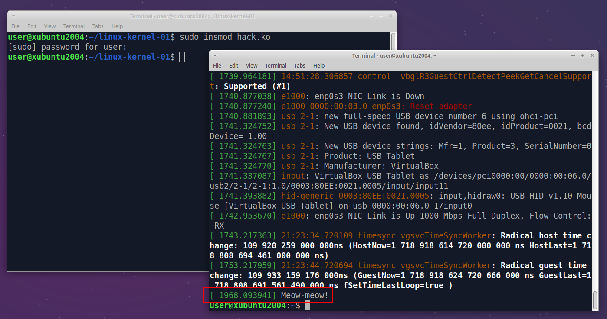
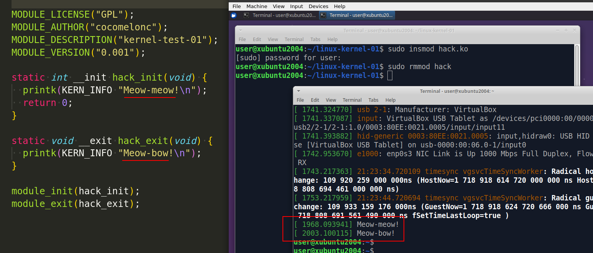

\newpage
\subsection{98. linux malware development 1: Intro to kernel hacking. Simple C example.}

﷽

{width="80%"}      

In fact, this post could be called something else like *"Malware development trick part 41"*, but here I again answer many questions that my readers ask me. *How can I develop malware for linux?*     

Perhaps this post will be the beginning and also the starting point for a series of posts (those who have been reading me for a long time have probably noticed that I have many different series of posts that I started but have not yet brought these series to their logical end).      

To be honest, my last experience of programming for Linux kernel was at the university about 10+ years ago, since then a lot has changed, so I decided to try to write something interesting like malware: linux rootkit, stealer, etc....

First of all, I installed a linux virtual machine - [xubuntu 20.04](https://xubuntu.org/) so as not to break anything in my system. I think you can install a more recent version of `Ubuntu (Xubuntu, Lubuntu)`, but version `20.04` is quite suitable for experiments:          

{width="80%"}      

### practical example

For example if we need create a malware, like a kernel rootkit, the code we develop will have the ability to execute with kernel level privileges (`ring 0`) using the kernel modules we create. Working in this role can have its challenges. On one hand, our work goes unnoticed by the user and userspace tools. However, if we make a mistake, it can have serious consequences. The kernel is unable to protect us from its own flaws, which means we risk crashing the entire system. Using VM will help alleviate the challenges of developing in our xubuntu, making it a much more manageable requirement.    

Let's start from import modules:    

```cpp
#include <linux/init.h>
#include <linux/module.h>
#include <linux/kernel.h>
```

These `#include` statements include the necessary header files for kernel module programming:
- `linux/init.h` - contains macros and functions for module initialization and cleanup.    
- `linux/module.h` - contains macros and functions for module programming.     
- `linux/kernel.h` - provides various functions and macros for kernel development.     

```cpp
MODULE_LICENSE("GPL");
MODULE_AUTHOR("cocomelonc");
MODULE_DESCRIPTION("kernel-test-01");
MODULE_VERSION("0.001");
```

These macros define metadata about the module:    

- `MODULE_LICENSE("GPL")` - specifies the license under which the module is released. Here, it's the GNU General Public License.    
- `MODULE_AUTHOR("cocomelonc")` - specifies the author of the module.     
- `MODULE_DESCRIPTION("kernel-test-01")` - Provides a description of the module.     
- `MODULE_VERSION("0.001")` - specifies the version of the module.      

At the next few lines we are define initialization function:     

```cpp
static int __init hack_init(void) {
  printk(KERN_INFO "Meow-meow!\n");
  return 0;
}
```

This function is the initialization function for the module:    
- `static int __init hack_init(void)` - defines the function as a static function (local to this file) and marks it as an initialization function using the `__init` macro.      
- `printk(KERN_INFO "Meow-meow!\n")` - prints the message `"Meow-meow!"` to the kernel log with an informational log level.
- `return 0` - returns `0` to indicate successful initialization.    

Next one is the `hack_exit` function:    

```cpp
static void __exit hack_exit(void) {
  printk(KERN_INFO "Meow-bow!\n");
}
```

This function is the cleanup function for the module:

- `static void __exit hack_exit(void)` - defines the function as a static function and marks it as an exit (cleanup) function using the __exit macro.
- `printk(KERN_INFO "Meow-bow!\n")` - prints the message `"Meow-bow!"` to the kernel log with an informational log level.    

Then, registering the initialization and cleanup functions:    

```cpp
module_init(hack_init);
module_exit(hack_exit);
```

So, the full source code is looks like this `hack.c`:    

```cpp
/*
 * hack.c
 * introduction to linux kernel hacking
 * author @cocomelonc
 * https://cocomelonc.github.io/linux/2024/06/20/kernel-hacking-1.html
*/
#include <linux/init.h>
#include <linux/module.h>
#include <linux/kernel.h>

MODULE_LICENSE("GPL");
MODULE_AUTHOR("cocomelonc");
MODULE_DESCRIPTION("kernel-test-01");
MODULE_VERSION("0.001");

static int __init hack_init(void) {
  printk(KERN_INFO "Meow-meow!\n");
  return 0;
}

static void __exit hack_exit(void) {
  printk(KERN_INFO "Meow-bow!\n");
}

module_init(hack_init);
module_exit(hack_exit);
```

This code demonstrates the basic structure of a Linux kernel module, including how to define initialization and cleanup functions and how to provide metadata about the module.     

### demo

Let's go to see this module in action. Before compiling you need install:    

```bash
$ apt update
$ apt install build-essential linux-headers-$(uname -r)
```

For compiling create `Makefile` file with the following content:     

```makefile
obj-m += hack.o

all:
	make -C /lib/modules/$(shell uname -r)/build M=$(PWD) modules

clean:
	make -C /lib/modules/$(shell uname -r)/build M=$(PWD) clean
```

The provided `Makefile` is used to compile and clean a Linux kernel module.     
`obj-m` variable is used to list the object files to be built as kernel modules. `hack.o` is the object file that will be built from the `hack.c` source file. The `+=` operator adds `hack.o` to the list of object files to be compiled as modules.     

```makefile
make -C /lib/modules/$(shell uname -r)/build M=$(PWD) modules
```

This command invokes `make` to compile the module. `-C /lib/modules/$(shell uname -r)/build` changes the directory to the build directory of the currently running kernel. `$(shell uname -r)` gets the version of the currently running kernel, and `/lib/modules/$(shell uname -r)/build` is where the kernel build directory is located.     

`M=$(PWD)` sets the `M` variable to the current working directory `$(PWD)`, which is where your module source code is located. This tells the kernel build system to look in the current directory for the module source files.     

and `modules` this target in the kernel build system compiles the modules listed in `obj-m`.

`make -C /lib/modules/$(shell uname -r)/build M=$(PWD) clean` - this command cleans up the module build files.     

Open a terminal, navigate to the directory containing `hack.c` and `Makefile`:    

{width="80%"}      

and run the following command to compile the module:    

```bash
make
```

{width="80%"}      

As a result, after running the `make` command, you will find several new intermediate binaries. However, the most significant addition will be the presence of a new `hack.ko` file.      

So, what's next. Run `dmesg` command in new terminal:    

```bash
dmesg
```

{width="80%"}      

Then run the following command from our `hack.ko` dir for load this module into running kernel:     

```bash
sudo insmod hack.ko
```

Now, if you check `dmesg` again from new terminal, you should see a `Meow-meow!` line:     

{width="80%"}      

For deleting our module from running kernel just run:      

```bash
sudo rmmod hack
```

{width="80%"}      

{width="80%"}      

As you can see, `Meow-bow!` message in kernel buffer, so everything is worked perfectly as expected! =^..^=     

There are one more caveat of course. When building a Linux kernel module, it is important to note that it belongs to the specific kernel version it was built on. If you attempt to load a module onto a system with a different kernel, it is highly probable that it will fail to load.        

I think we'll take a break here, we'll look at rootkits and stealers in the following posts.      

I hope this post with practical example is useful for malware researchers, linux programmers and everyone who interested on linux kernel programming techniques.    

[source code in github](https://github.com/cocomelonc/meow/tree/master/2024-06-20-linux-kernel-hacking-1)    
