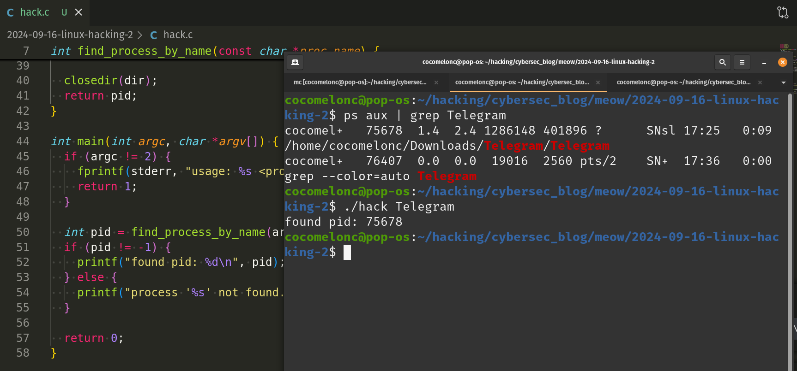
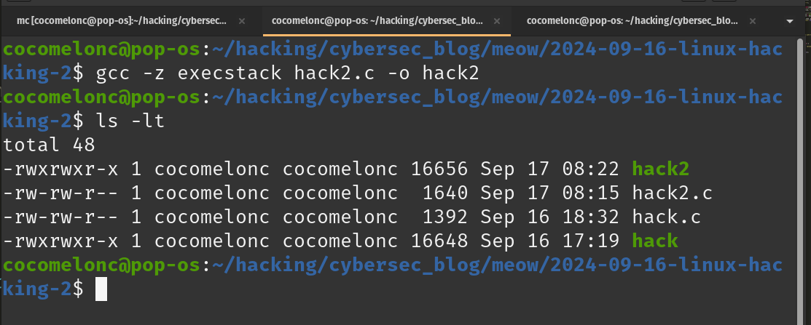
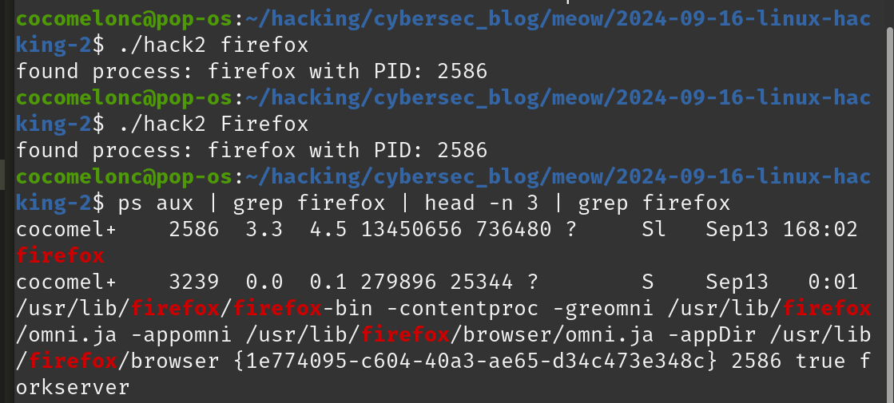

\newpage
\subsection{99. linux malware development 2: find process ID by name. Simple C example.}

﷽

{width="80%"}     

I promised to shed light on programming rootkits and other interesting and evil things when programming malware for Linux, but before we start, let's try to do simple things. Some of my readers have no idea how to do, for example, code injections into Linux processes.    

Those who have been reading me for a very long time remember such an interesting and simple [example of finding](https://cocomelonc.github.io/pentest/2021/09/29/findmyprocess.html) the process identifier in Windows for injection purposes.     

### practical example

Let's implement similar logic for Linux. Everything is very simple:    

```cpp
/*
 * hack.c
 * linux hacking part 2: 
 * find process ID by name
 * author @cocomelonc
 * https://cocomelonc.github.io/linux/2024/09/16/linux-hacking-2.html
*/
#include <stdio.h>
#include <stdlib.h>
#include <string.h>
#include <dirent.h>
#include <ctype.h>

int find_process_by_name(const char *proc_name) {
  DIR *dir;
  struct dirent *entry;
  int pid = -1; 

  dir = opendir("/proc");
  if (dir == NULL) {
    perror("opendir /proc failed"); 
    return -1;
  }

  while ((entry = readdir(dir)) != NULL) {
    if (isdigit(*entry->d_name)) { 
      char path[512];
      snprintf(path, sizeof(path), "/proc/%s/comm", entry->d_name); 

      FILE *fp = fopen(path, "r");
      if (fp) {
        char comm[512];
        if (fgets(comm, sizeof(comm), fp) != NULL) {
          // remove trailing newline from comm
          comm[strcspn(comm, "\r\n")] = 0; 
          if (strcmp(comm, proc_name) == 0) {
            pid = atoi(entry->d_name); 
            fclose(fp);
            break;
          }
        }
        fclose(fp);
      }
    }
  }

  closedir(dir);
  return pid;
}

int main(int argc, char *argv[]) {
  if (argc != 2) {
    fprintf(stderr, "usage: %s <process_name>\n", argv[0]);
    return 1;
  }

  int pid = find_process_by_name(argv[1]);
  if (pid != -1) {
    printf("found pid: %d\n", pid);
  } else {
    printf("process '%s' not found.\n", argv[1]);
  }

  return 0;
}
```

My code demonstrates how to search for a running process by its name in Linux by scanning the `/proc` directory. It reads the process names stored in `/proc/[pid]/comm`, and if it finds a match, it retrieves the process ID (`PID`) of the target process.      

As you can see there are only two functions here. First of all, we implemented `find_process_by_name` function. This function is responsible for searching for the process by name within the `/proc` directory.     

It takes a process name (`proc_name`) as input and returns the `PID` of the found process or `-1` if the process is not found.    

The function uses the `opendir()` function to open the /proc directory. This directory contains information about running processes, with each subdirectory named after a process ID (`PID`).    

Then, iterate through entries in `/proc`:    

```cpp
while ((entry = readdir(dir)) != NULL) {
```

the `readdir()` function is used to iterate through all entries in the `/proc` directory, each entry represents either a running process (if the entry name is a number) or other system files.    

Then checks whether the entry name represents a number (i.e., a process ID). Only directories named with digits are valid process directories in `/proc`:    

```cpp
if (isdigit(*entry->d_name)) {
```

Note that, the `comm` file inside each `/proc/[pid]` directory contains the name of the executable associated with that process:    

```cpp
snprintf(path, sizeof(path), "/proc/%s/comm", entry->d_name);
```

that means, we constructs the full path to the `comm` file by combining `/proc/`, the process ID (`d_name`), and `/comm`.    

Finally, we open `comm` file, read process name and compare it:    

```cpp
FILE *fp = fopen(path, "r");
  if (fp) {
    char comm[512];
    if (fgets(comm, sizeof(comm), fp) != NULL) {
      // remove trailing newline from comm
      comm[strcspn(comm, "\r\n")] = 0; 
      if (strcmp(comm, proc_name) == 0) {
        pid = atoi(entry->d_name); 
        fclose(fp);
        break;
      }

    }
```

Then, of course, close the directory and return.    

The second function is the `main` function:     

```cpp
int main(int argc, char *argv[]) {
  if (argc != 2) {
    fprintf(stderr, "usage: %s <process_name>\n", argv[0]);
    return 1;
  }

  int pid = find_process_by_name(argv[1]);
  if (pid != -1) {
    printf("found pid: %d\n", pid);
  } else {
    printf("process '%s' not found.\n", argv[1]);
  }

  return 0;
}
```

Just check command-line args and run process finding logic.     

### demo

Let's check everything in action. Compile it:     

```bash
gcc -z execstack hack.c -o hack
```

{width="80%"}     

Then run it in linux machine:     

```bash
.\hack [process_name]
```

{width="80%"}     

{width="80%"}     

As you can see, everything is wokred perfectly. We found Telegram ID (`75678`) in my case! =^..^=    

It all seems very easy, doesn't it?     

But there is a caveat. If we try to run it for processes like `firefox` in my example:     

```bash
.\hack firefox
```

we got:    

{width="80%"}     

The issue we're facing may stem from the fact that some processes, like `firefox`, might spawn child processes or multiple threads, which might not all use the comm file to store their process name.      

The `/proc/[pid]/comm` file stores the executable name without the full path and may not reflect all instances of the process, especially if there are multiple threads or subprocesses under the same parent.     

So possible issues in my opinion are:    
- different process names in `/proc/[pid]/comm`: child processes or threads could use different naming conventions or might not be listed under `/proc/[pid]/comm` as `firefox`.       
- zombies or orphan processes: some processes might not show up correctly if they are in a zombie or orphaned state.     

### practical example 2

Instead of reading the `comm` file, we can check the `/proc/[pid]/cmdline` file, which contains the full command used to start the process (including the process name, full path, and arguments). This file is more reliable for processes that spawn multiple instances like `firefox`.     

For this reason I just created another version (`hack2.c`):    

```cpp
/*
 * hack2.c
 * linux hacking part 2: 
 * find processes ID by name
 * author @cocomelonc
 * https://cocomelonc.github.io/linux/2024/09/16/linux-hacking-2.html
*/
#include <stdio.h>
#include <stdlib.h>
#include <string.h>
#include <dirent.h>
#include <ctype.h>

void find_processes_by_name(const char *proc_name) {
  DIR *dir;
  struct dirent *entry;
  int found = 0;

  dir = opendir("/proc");
  if (dir == NULL) {
    perror("opendir /proc failed");
    return;
  }

  while ((entry = readdir(dir)) != NULL) {
    if (isdigit(*entry->d_name)) {
      char path[512];
      snprintf(path, sizeof(path), "/proc/%s/cmdline", entry->d_name);

      FILE *fp = fopen(path, "r");
      if (fp) {
        char cmdline[512];
        if (fgets(cmdline, sizeof(cmdline), fp) != NULL) {
          // command line arguments are separated by '\0', 
          // we only need the first argument (the program name)
          cmdline[strcspn(cmdline, "\0")] = 0;

          // perform case-insensitive comparison 
          // of the base process name
          const char *base_name = strrchr(cmdline, '/');
          base_name = base_name ? base_name + 1 : cmdline;

          if (strcasecmp(base_name, proc_name) == 0) {
            printf("found process: %s with PID: %s\n", base_name, 
            entry->d_name);
            found = 1;
          }
        }
        fclose(fp);
      }
    }
  }

  if (!found) {
    printf("no processes found with the name '%s'.\n", proc_name);
  }

  closedir(dir);
}

int main(int argc, char *argv[]) {
  if (argc != 2) {
    fprintf(stderr, "usage: %s <process_name>\n", argv[0]);
    return 1;
  }

  find_processes_by_name(argv[1]);

  return 0;
}
```

As you can see, this is an updated version of the code that reads from `/proc/[pid]/cmdline` instead.     

But the file `/proc/[pid]/cmdline` or `/proc/[pid]/status` may not always show all subprocesses or threads correctly.     

### demo 2

Let's check second example in action. Compile it:     

```bash
gcc -z execstack hack2.c -o hack2
```

{width="80%"}     

Then run it in linux machine:     

```bash
.\hack [process_name]
```

{width="80%"}     

As you can see, it's correct.     

I hope this post with practical example is useful for malware researchers, linux programmers and everyone who interested on linux kernel programming and code injection techniques.    

[Find process ID by name. Windows version](https://cocomelonc.github.io/pentest/2021/09/29/findmyprocess.html)      
[source code in github](https://github.com/cocomelonc/meow/tree/master/2024-09-16-linux-hacking-2)    
